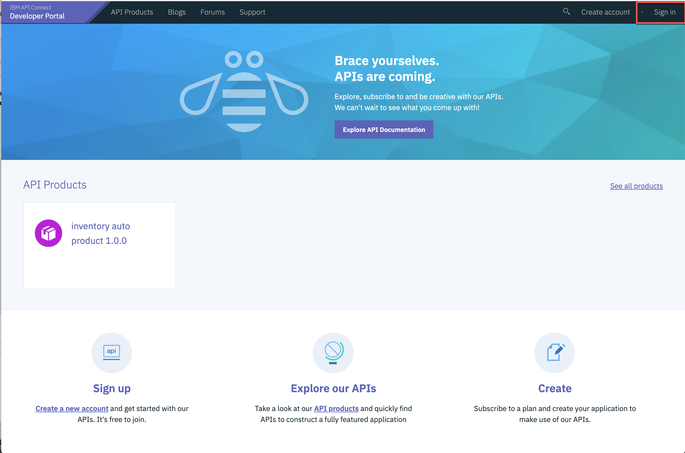

**APIC Dev Jam - Lab 2 - The Developer Portal Experience**

::: 
::: 
**Table of Contents**
:::

***[APIC Dev Jam Series 1](#__RefHeading___Toc277_3603618113)***

[Prerequisites: Labs 1 2](#__RefHeading___Toc279_3603618113)

***[Generate the developer portal
2](#__RefHeading___Toc281_3603618113)***

***[Register a test app 4](#__RefHeading___Toc283_3603618113)***

**[Create A New Consumer Application
5](#__RefHeading___Toc285_3603618113)**

**[Save the Consumer Application Credentials
6](#__RefHeading___Toc287_3603618113)**

**[Subscribe to the API Product 7](#__RefHeading___Toc289_3603618113)**

***[Test the API 10](#__RefHeading___Toc291_3603618113)***

***[Summary 12](#__RefHeading___Toc293_3603618113)***
:::

In this lab, we will take the API created in Lab 1 and publish it to a
Developer Portal, ready for consumption by app developers. We will begin
by creating a new catalog and configuring the developer portal for our
Inventory product. We will then define a new plan in the product and
publish to our new developer portal.

In this tutorial, you will explore the following key capabilities:

-   Configure the Developer Portal and publish the APIs.

-   Create a Portal Account.

-   Create App and Subscribe to Plan.

-   Test API in the Developer Portal

 APIC Dev Jam Series 
==================================================================================================================================================================================================================

The APIC Dev Jam Series is a hands-on workshop with lab exercises that
walk you through designing, publishing, and securing APIs. This workshop
is for API developers, architects, and line of business people who want
to create a successful API strategy. There are 8 labs and each is 30
minutes long. Make sure you choose enough time in your reservation to
get through all the labs! 

 

[NOTE: ]**[This demo environment contains a
full API Connect installation in Cloud Pak for Integration. The login
information to the APIC cluster will be sent in a separate email when
you reserve the instance. Use Google Chrome, Firefox or Microsoft Edge
to access the cluster using the credentials supplied. Make sure you
login using API Manager User Registry not Common Services
registry.]**

[Lab 1 : Create and Secure an API to Proxy an Existing REST Web
service](https://ibm.biz/TechConLabs/APICDevJam/Lab1)

[Lab 2 : The Developer Portal
Experience](https://ibm.biz/TechConLabs/APICDevJam/Lab2)

[Lab 3 : Add OAuth Security to your
API](https://ibm.biz/TechConLabs/APICDevJam/Lab3)

[Lab 4 : Use Lifecycle Controls to Version Your
API](https://ibm.biz/TechConLabs/APICDevJam/Lab4)

[Lab 5: Advanced API
Assembly](https://ibm.biz/TechConLabs/APICDevJam/Lab5)

[Lab 6: Working with API
Products](https://ibm.biz/TechConLabs/APICDevJam/Lab6)

[Lab 7: The Consumer
Experience](https://ibm.biz/TechConLabs/APICDevJam/Lab7)

[Lab 8: Create and test GraphQL Proxy
API](https://ibm.biz/TechConLabs/APICDevJam/Lab8)

[]
Prerequisites: Labs 1

 Generate the developer portal 
====================================================================================

 

A developer portal for the sandbox catalog was already configured in
this environment. A consumer account "ibmuser" was also created to use
the Developer Portal server. In this section, login to Developer Portal
using the credentials provided in email.

**Login to API Connect Developer Portal**

1.  API Connect Developer Portal provides consumers access to API
    Catalog information to explore and test APIs, register Applications
    and subscribe to Plans. Portal Administrator can customize the looks
    and feel to their organizational specifications. The default
    Developer Portal looks like below:



2.  Some products are visible to all users without an account depending
    on the Product visibility setting. Additional options are available
    when you login to the Portal Server.

Click **Sign in** to login to the portal


3.  Login to portal user using the username and password supplied in the
    email.


4.  After successful login, you will see a Get Started page. Proceed to
    create a new Test application.

 

 Register a test app 
==========================================================================

API Connect enforces entitlement rules to ensure that consumers are
allowed to access the APIs that are being requested. The instructions
below will guide you through registering your consumer application and
subscribing it to an API Product.

 [Create A New Consumer Application] 
-----------------------------------------------------------------------------------------------------------------------------------------------------

1.  Click [[Create an
    App]] in
    the *Create a new App* tile.


2.  Give your application the title **[IBM
    Consumer ]**and then
    click [[Submit]].


 [Save the Consumer Application Credentials] 
-------------------------------------------------------------------------------------------------------------------------------------------------------------

When your consumer application is registered in the IBM API Connect
system, it is assigned a unique set of client credentials. These
credentials must be provided on each API request in order for the system
to validate your subscription entitlements.

1.  Click the [[Show]] box
    in both Key and Secret to reveal it. Copy the Key and Secret. Save
    it to a text editor. Then
    click [[Continue. ]]You
    can always come back to view the Key. However, if you lose the
    Secret, you will need to generate a new one in the app settings.


2.  Now you\'ve entered the App Dashboard. Here you\'re able to see the
    analytics of your APIs.

 [Subscribe to the API Product] 
------------------------------------------------------------------------------------------------------------------------------------------------

At this point, your registered consumer application has no entitlements.
In order to grant it access to an API resource, you must subscribe to a
Product and Plan.

1.  Click [[API
    Products]] at
    the top of the screen.

```
<!-- -->
```
2.  Click the [[inventory auto product
    1.0.0]] product.


1.  Click the [[Subscribe]] button
    for the default plan that is listed.

2.  Follow the steps to **Select your application**, **Confirm
    Subscription**, and **View Summary**. Then click **Done**.


 Test the API 
===================================================================

The API Connect Developer Portal allows consumers to test the APIs
directly from the website. This feature may be enabled or disabled
per-API.

1.  Open the **inventory 1.0.0** API to browse the API definition.


2.  Click the [[GET
    /Items]] operation
    on the left palette.

3.  In the right column, you will find information about the request
    parameters and links to the response schemas.

4.  Click the [[Try
    it]] tab.


5.  If you only have one application registered, it will be
    automatically selected in the **[Client
    ID]** drop-down menu. If you have more
    than one, select the application which is subscribed to this API
    Product.

6.  Paste your **[Client Secret]** into the
    provided field.

7.  Click the [[Send]] button
    to invoke the API.

8.  Scroll down to see the call results.

**[Note: If running for the first time, you may see Code: 0 No response
received. Causes include a lack of CORS support on the target server,
the server being unavailable, or an untrusted certificate being
encountered. Clicking the link below will open the server in a new tab.
If the browser displays a certificate issue, you may choose to accept it
and return here to test again.]**


 Summary 
==============================================================

You completed the APIC Dev Jam Lab 2 - The Developer Portal Experience.
Throughout the tutorial, you explored the key takeaways: 

-   Configure Developer Portal and publish the APIs.

-   Create a Portal Account. 

-   Create App and Subscribe to Plan

-   Test API in Developer Portal. 

Continue the APIC Dev Jam! Go to [APIC Dev Jam - Lab 3 - Add OAuth
Security to your
API](https://ibm.com/cloud/garage/dte/tutorial/apic-dev-jam-lab-3-add-oauth-security-your-api) to
learn about configuring an OAuth provider service. 
