**APIC Dev Jam Lab 3 - Add OAuth Security to your API**

In this lab, you will secure the Inventory API to protect the resources
exposed by **API Connect**. Consumers of your API will be required to
obtain and provide a valid OAuth token before they can invoke the
Inventory API.

In this tutorial, you will explore the following key capabilities:

-   Configure an OAuth 2.0 service, the Resource Owner Password grant
    type.

-   Clone a new version of an API.

-   Secure the new version of your API.

 APIC Dev Jam Series
==================================================================================================================================================================================================================

The APIC Dev Jam Series is a hands-on workshop with lab exercises that
walk you through designing, publishing, and securing APIs. This workshop
is for API developers, architects, and line of business people who want
to create a successful API strategy. There are 8 labs and each is 30
minutes long. Make sure you choose enough time in your reservation to
get through all the labs! 

[NOTE: ]**[This demo environment contains a
full API Connect installation in Cloud Pak for Integration. The login
information to the APIC cluster will be sent in a separate email when
you reserve the instance. Use Google Chrome, Firefox or Microsoft Edge
to access the cluster using the credentials supplied. Make sure you
login using API Manager User Registry not Common Services
registry.]**

[Lab 1 : Create and Secure an API to Proxy an Existing REST Web
service](https://integrationsuperhero.github.io/techcon2020/APICDevJam/Lab1)

[Lab 2 : The Developer Portal
Experience](https://integrationsuperhero.github.io/techcon2020/APICDevJam/Lab2)

[Lab 3 : Add OAuth Security to your
API](https://integrationsuperhero.github.io/techcon2020/APICDevJam/Lab3)

[Lab 4 : Use Lifecycle Controls to Version Your
API](https://integrationsuperhero.github.io/techcon2020/APICDevJam/Lab4)

[Lab 5: Advanced API
Assembly](https://integrationsuperhero.github.io/techcon2020/APICDevJam/Lab5)

[Lab 6: Working with API
Products](https://integrationsuperhero.github.io/techcon2020/APICDevJam/Lab6)

[Lab 7: The Consumer
Experience](https://integrationsuperhero.github.io/techcon2020/APICDevJam/Lab7)

[Lab 8: Create and test GraphQL Proxy
API](https://integrationsuperhero.github.io/techcon2020/APICDevJam/Lab8)

Prerequisites: Labs 1-2

 Configure a New OAuth 2.0 Provider API
=============================================================================================

API Connect is a full-featured OAuth 2.0 provider. The OAuth exchange
works like any other API call, and thus we treat it as its own API. In
this section, you will create a new OAuth provider API, configure which
grant type to use, and configure how it will authenticate user
credentials.

 Configure Authentication URL User Registry
--------------------------------------------------------------------------------------------------------------------------------------------------------------

In order to configure user authentication, you must first define the
registry to use, which may be LDAP, local user registry, or an
authentication URL. For our lab, we will implement an Authentication
URL.

1.  In the API Manager from the main menu on the left,
    click [[Resources]].

    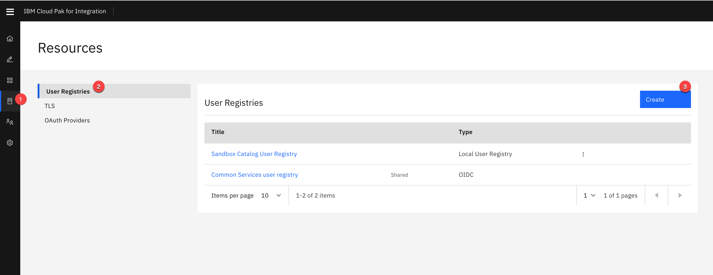

2.  Select the [[Authentication URL User
    Registry]] tile.

    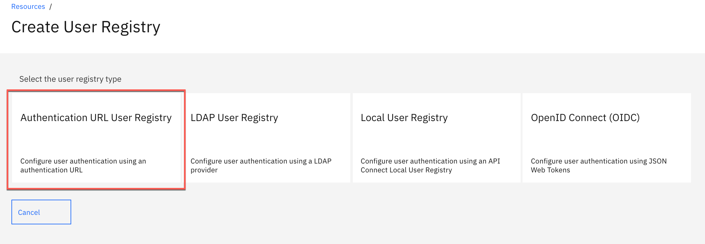

3.  Specify the only following properties and then
    click [[Save.]]

    Title: [[App Registry]]

    URL: <https://thinkibm-services.mybluemix.net/auth>

    Display name:[[ App Registry]]

    Click **Save** to save the resource

    

 Create OAuth Service
----------------------------------------------------------------------------------------------------------------------------------------

1.  In the API Manager from the main menu on the left,
    click [[Resources]].

2.  In the Resources menu, click  [[OAuth Providers-\> Native OAuth
    Provider]].

    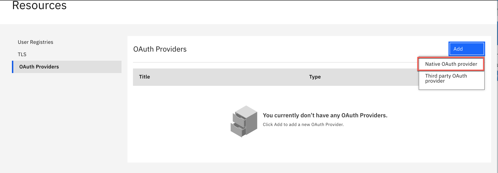

3.  Specify the following properties and
    click **[Next]** to continue.

    Title: [[oauth]]

    Name: [[oauth]]

    Gateway Type: [[DataPower API Gateway]]

    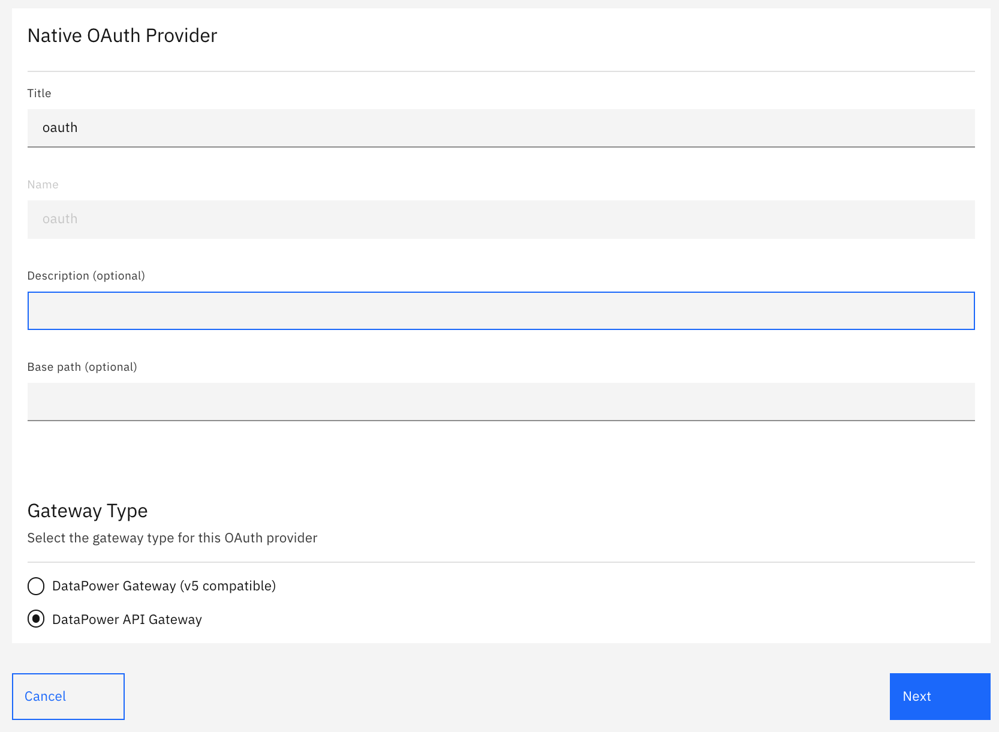

4.  The next configuration screen will display the default paths to the
    Authorize and Token functions. For Supported grant types,
    choose [[Resource owner
    password]].
    For Supported Client types,
    choose [[Confidential]].
    Click [[Next]] continue.

    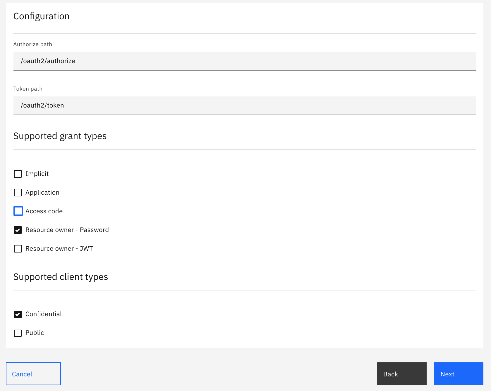

5.  One scope is generated for you
    : [**[sample_scope_1]**[.]]

6.  Modify the values
    for **[sample_scope_1]**, set the
    following fields:

    Name: [[inventory]]

    Description: [[Access to Inventory API]]

    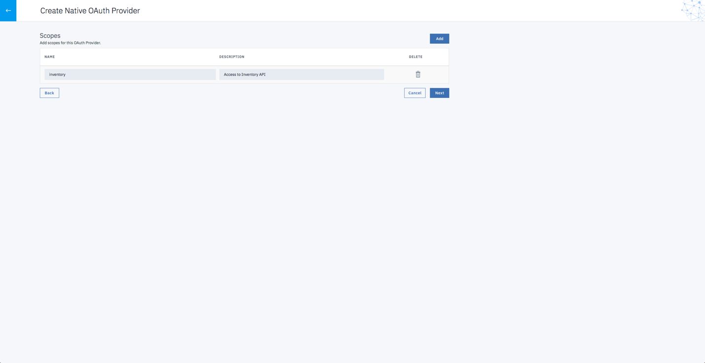

7.  Click [[Next]].

8.  Keep all items default.
    Click [[Next.]]

    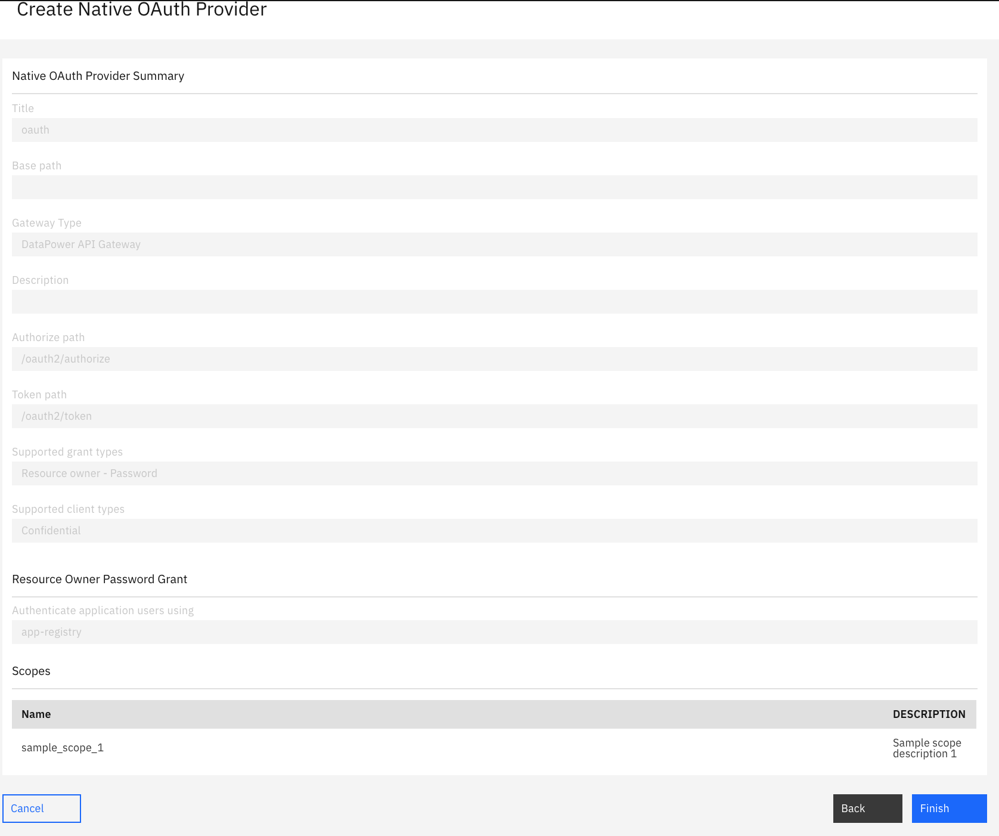

9.  Review your OAuth configuration and
    click [[Finish]].
    Then click on the back arrow.

10. From the Sandbox Catalog registry setting, select API User
    Registries and Add App Registry. To open Sandbox Settings follow
    Home-\>Manage Catalogs-\>Sandbox-\>Settings(Gearbox)->API User Registries.

    Use **Edit** option and enable available API registry.

    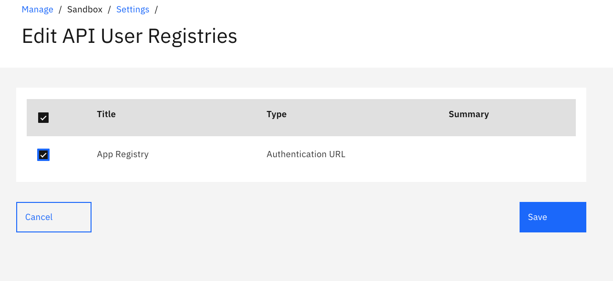

 Add the OAuth Service to the Sandbox Catalog
----------------------------------------------------------------------------------------------------------------------------------------------------------------

1.  From the left menu, click [[Home Button
    Icon]].

2.  Click the [[Manage
    Catalog]] catalog
    and select
    [[Sandbox]] 

3.  From the left menu,
    click [[Settings]]
    gearbox.

4.  On the displayed menu, click [[OAuth
    Providers]].

5.  Click [[Edit]].

6.  Choose the OAuth service created above. Then
    click [[Save]].
    Click on the back arrow to go back to Manage.

    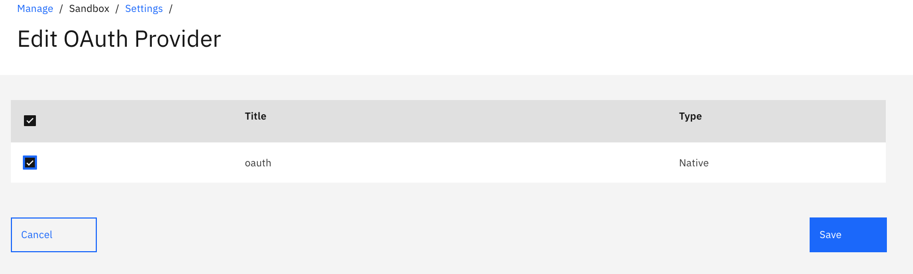

 Create a New Version of the Inventory API
================================================================================================

API Connect supports multiple versions of APIs. Create a new version of
the inventory API before making any changes that would break
functionality for existing consumers. 

 [Save as a New Version]
-----------------------------------------------------------------------------------------------------------------------------------------

1.  In the API Manager from the main menu on the left,
    click [[Develop]].

2.  Click on the menu icon to the right of [[inventory
    1.0.0]] API
    and select [[Save as a new
    version]].  

    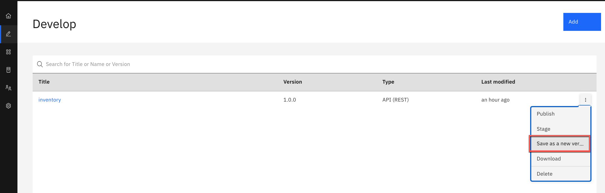

3.  Enter the new version number
    as [[2.0.0]] and
    click [[Submit]].

 Add OAuth security to the Inventory API
==============================================================================================

Modify the security policy for your new API version to tell it to use
your OAuth 2.0 provider.

1.  From the Develop home page, click \`**Inventory 2.0.0**\`

2.  Navigate to the **[Security
    Definitions]** section.

3.  Click [[Add]].

4.  On the API Security Definition screen, enter the following:

    -   Name: **[oauth-1]**

    -   Description: [[API OAuth security
        definition]]

    -   Type: [[OAuth2]]

    -   Flow: [[Resource owner]]

    -   Token URL: keep
        default [[https://\$(catalog.url)/oauth/oauth2/token]]

    -   Leave everything else to the default values and
        click **Save**.  

        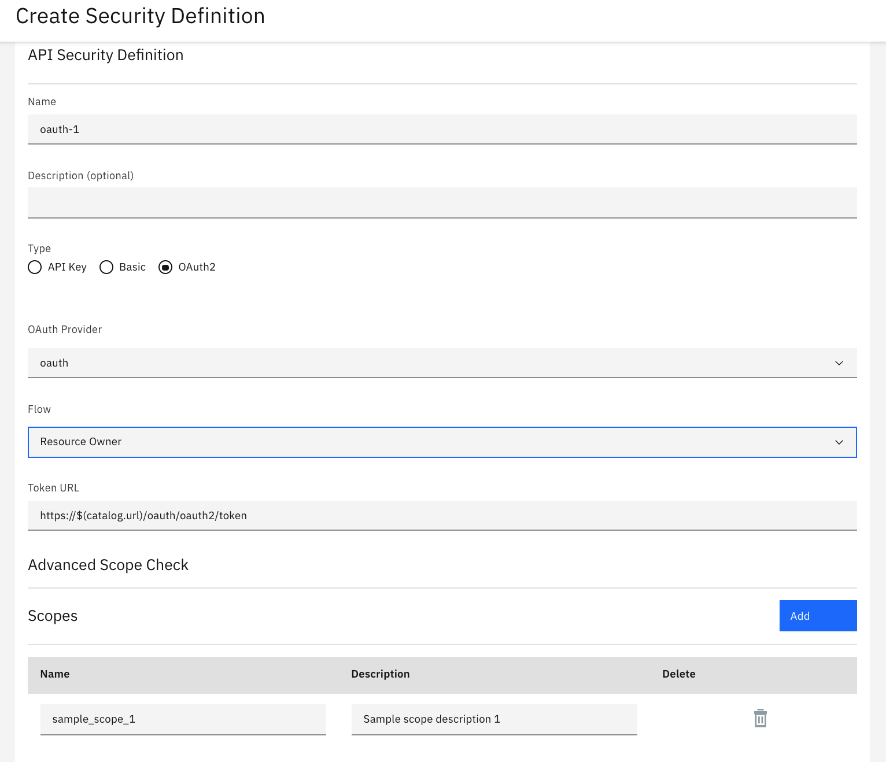

5.  Navigate to the \`Security\` section and check the \`**oauth-1
    (OAuth)**\` checkbox. Make sure \`inventory\` is also checked.  

    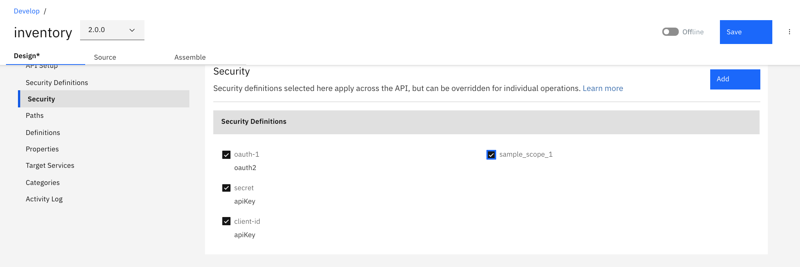

6.  Save your changes.

 Summary
==============================================================

You completed the APIC Dev Jam Lab 3 - Add OAuth Security to your
API. Throughout the tutorial, you explored the key takeaways:

-   Configure an OAuth 2.0 service, the Resource Owner Password grant
    type.

-   Clone a new version of an API.

-   Secure the new version of your API.

Continue the APIC Dev Jam! Go To [APIC (v10) Dev Jam Lab 4 - Use
Lifecycle controls to version your
API](https://integrationsuperhero.github.io/techcon2020/APICDevJam/Lab4) to
manage the lifecycle of this API and test your new OAuth secured API.
