**APIC Dev Jam Lab 4 - Use Lifecycle Controls to Version your API**

In the previous lab, you created a new version of the inventory API
which is secured with an OAuth 2.0 provider. At this stage, however, the
changes are still in draft mode. In order for the changes to take
effect, you must publish the APIs to the developer portal and make them
available for the API Consumers. Recall though that the inventory 1.0.0
version is already running and has active subscribers.

API lifecycle management capabilities is an essential part of the API
Management platform. The API lifecycle includes the following stages:

1.  Plan and design the API.

2.  Develop the API.

3.  Test the API.

4.  Deploy (publish) the API.

5.  Retire and deprecate the API.

In this tutorial, you will explore the following key capabilities:

-   Creating a new API Product

-   Replacing the Old Product

-   Testing Your OAuth API in the Developer Portal

 APIC Dev Jam Series
==================================================================================================================================================================================================================

The APIC Dev Jam Series is a hands-on workshop with lab exercises that
walk you through designing, publishing, and securing APIs. This workshop
is for API developers, architects, and line of business people who want
to create a successful API strategy. There are 8 labs and each is 30
minutes long. Make sure you choose enough time in your reservation to
get through all the labs! 

[NOTE: ]**[This demo environment contains a
full API Connect installation in Cloud Pak for Integration. The login
information to the APIC cluster will be sent in a separate email when
you reserve the instance. Use Google Chrome, Firefox or Microsoft Edge
to access the cluster using the credentials supplied. Make sure you
login using API Manager User Registry not Common Services
registry.]**

[Lab 1 : Create and Secure an API to Proxy an Existing REST Web
service](https://integrationsuperhero.github.io/techcon2020/APICDevJam/Lab1)

[Lab 2 : The Developer Portal
Experience](https://integrationsuperhero.github.io/techcon2020/APICDevJam/Lab2)

[Lab 3 : Add OAuth Security to your
API](https://integrationsuperhero.github.io/techcon2020/APICDevJam/Lab3)

[Lab 4 : Use Lifecycle Controls to Version Your
API](https://integrationsuperhero.github.io/techcon2020/APICDevJam/Lab4)

[Lab 5: Advanced API
Assembly](https://integrationsuperhero.github.io/techcon2020/APICDevJam/Lab5)

[Lab 6: Working with API
Products](https://integrationsuperhero.github.io/techcon2020/APICDevJam/Lab6)

[Lab 7: The Consumer
Experience](https://integrationsuperhero.github.io/techcon2020/APICDevJam/Lab7)

[Lab 8: Create and test GraphQL Proxy
API](https://integrationsuperhero.github.io/techcon2020/APICDevJam/Lab8)

Prerequisites: Labs 1-3

 Create A New Product
===========================================================================

In IBM API Connect, Plans and APIs are grouped together in Products,
with which you can manage the availability and visibility of APIs and
Plans. Products allow related APIs to be bundled together for
subscribers. In Lab 1, when the inventory microservice application was
generated, it also created a default product. In this section, you will
create a new product from scratch and stage it to your API Manager
environment.

The following link provides more information about API Products in IBM
API Connect:

<https://www.ibm.com/support/knowledgecenter/en/SSMNED_v10/com.ibm.apic.toolkit.doc/capim_products.html>

1.  Go to the **[Develop]** tab in your API
    Connect manager interface.

2.  Click **[Add]** and
    select **[Product.]**

3.  Click **[New product]** and then
    click [[Next.]]

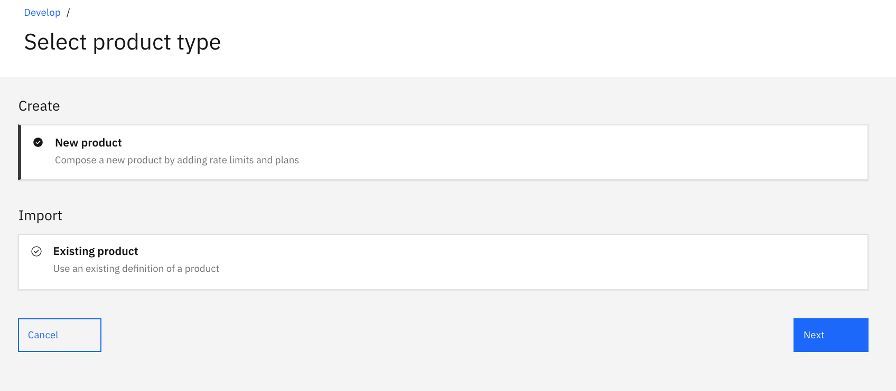

4.  Title this product [[Think
    Inventory]] and
    click [[Next.]]

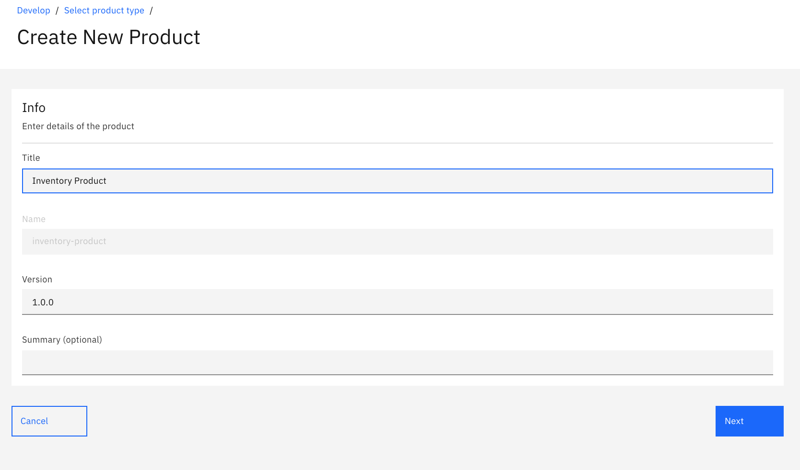

5.  Select the [[inventory
    2.0.0 API]],
    then click **[Next]**.

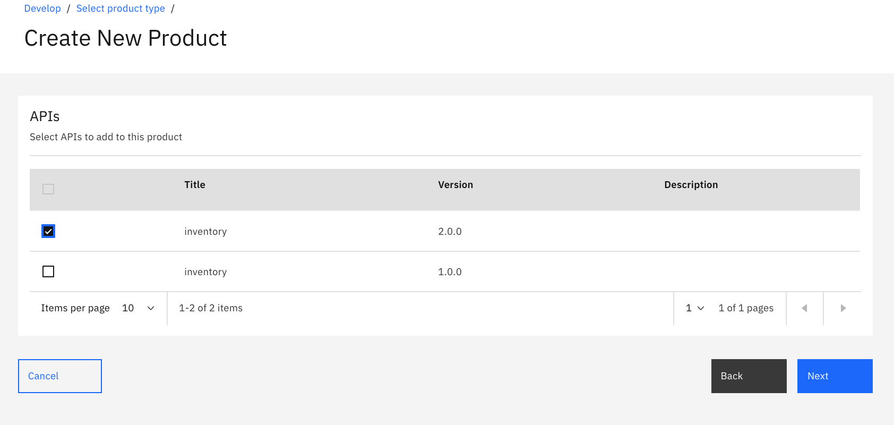

6.  Add the **[Default Plan]** to your
    product and then click **[Next.]**

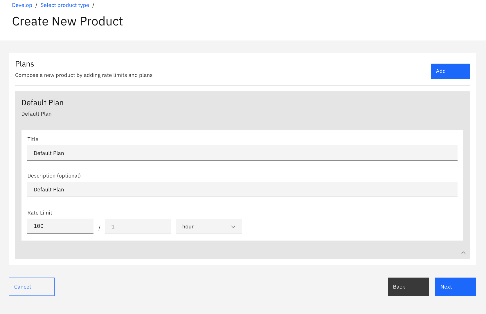

7.  Keep the default settings and
    click **[Next.]**

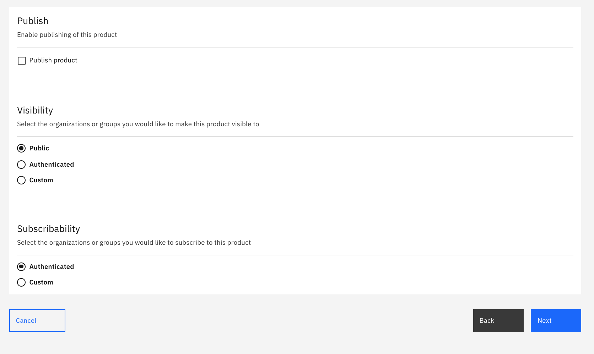

8.  Your product will be created and associated with the required object
    such as APIs and Plans.

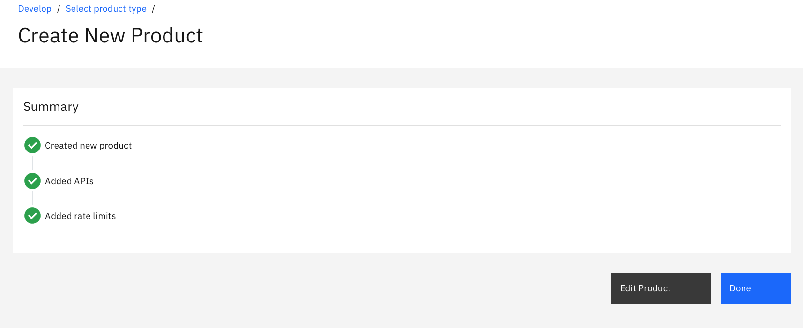

9.  Click **[Edit Product]**. You may want
    to browse across other sections of the \*API Product\* menu such as
    \*Visibility\*, \*Plans\*, and \*Categories\* to explore additional
    API Product management capabilities provided by IBM API Connect.
    Based on the information provided, API Connect will generate a yaml
    definition of your API Product. You can check it by clicking on
    the **[Source]** button at the top.

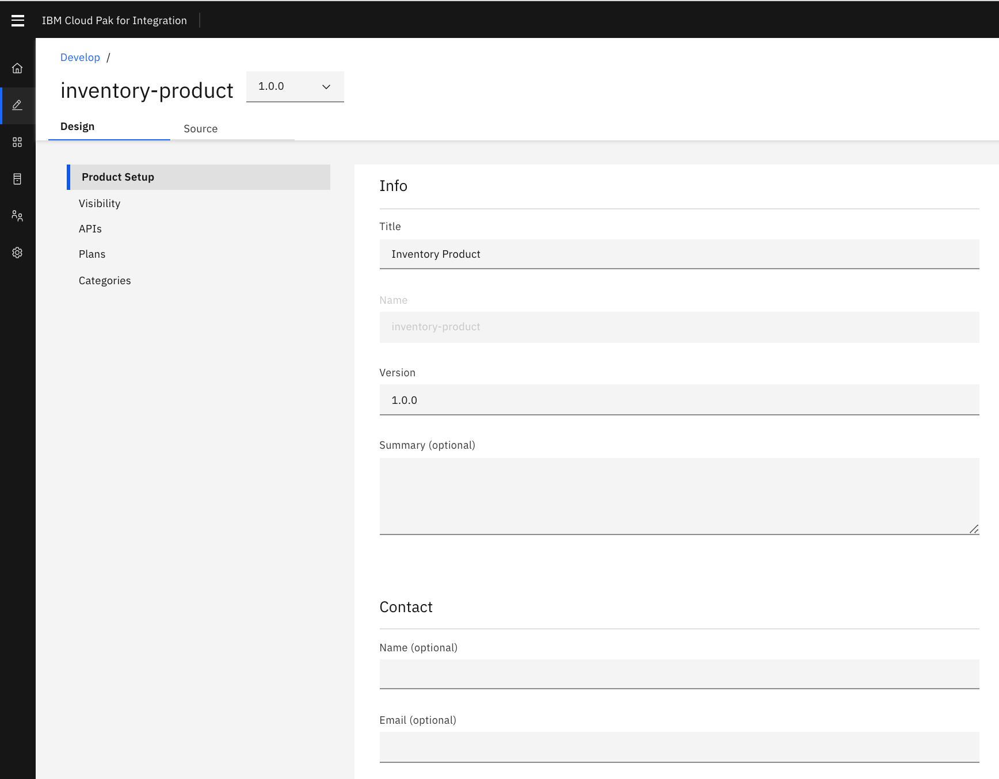

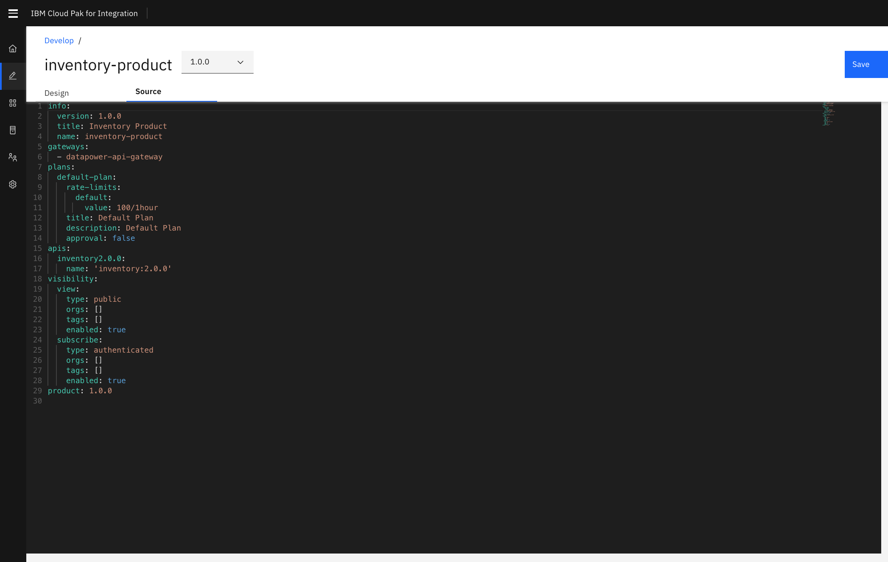

 

 [Stage the Product to your API Manager environment]
---------------------------------------------------------------------------------------------------------------------------------------------------------------------

Before an API Product can be published, you must first stage that
Product to a Catalog. When a Product is in the staged state, it is not
yet visible to, or subscribable by developers. However, it can be
reviewed by the API Product Manager and Published once it is decided
that the API Product is ready to be consumed.

If you stage a Product to a Catalog, editing and then restaging that
Product through the Products tab of API Designer or API Manager will
affect changes to the staged version.

1.  In the API Manager, from the main menu on the left,
    click **[Develop]**.

2.  Click the **[⋮]** button next to your
    API Product and **[Stage]** it.

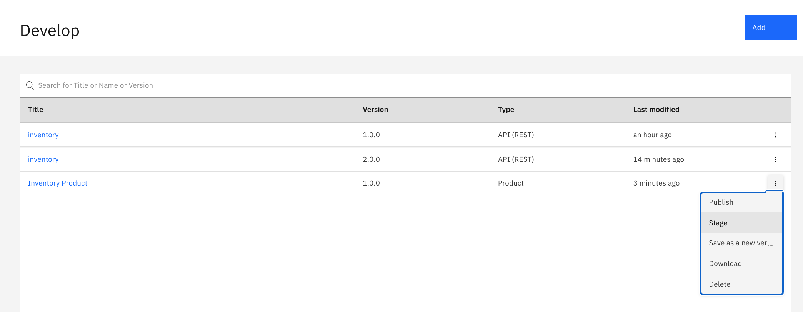

3.  Choose your **[Sandbox]** catalog as a
    target for Staging.

**Note:**

IBM API Connect allows you to publish products to specific gateways
associated with the Catalog.

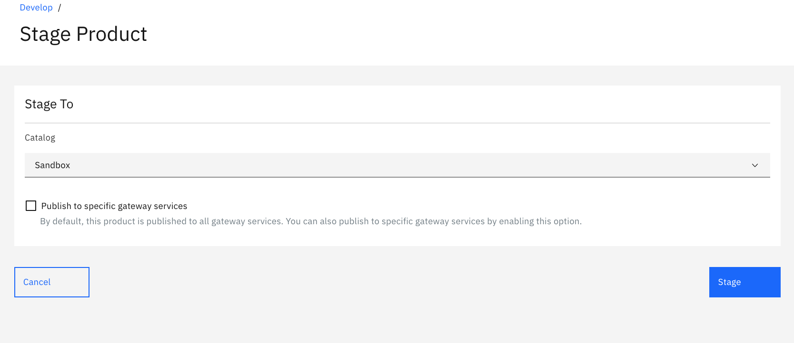

 

 Supersede the Old Product
================================================================================

IBM API Connect provides capabilities for managing the lifecycle of your
API Products. There are various states which an API Product can reside
in, as well as controls around when you can move an API Product from one
state to another. In this section, you will explore how to replace a
running version of an API Product with a new one.

1. Switch to the **[Manage]** tab of the
interface and click on
your **[Sandbox]** catalog tile.

    

2. The **[Products tab]** will list all of
the API Products that this Catalog is currently managing.

3. Make sure your newly created API Product **[Think
Inventory]** is in
the **[Staged]** status while the
old **[Inventory APIs]** product
is **[Published]** in the Catalog.

    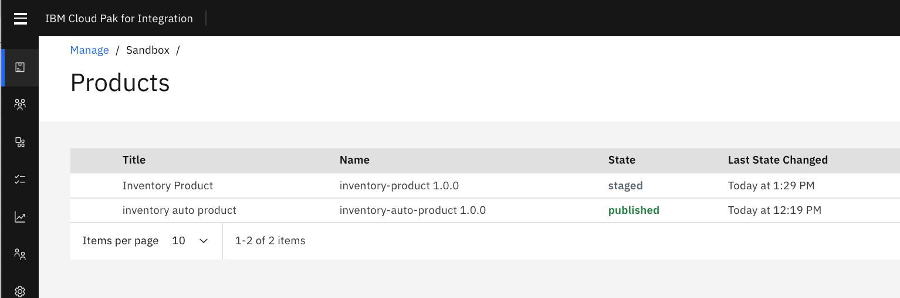

4. Click on the menu options for the **[Inventory
APIs]** product and select
the **[Supersede]** option.

    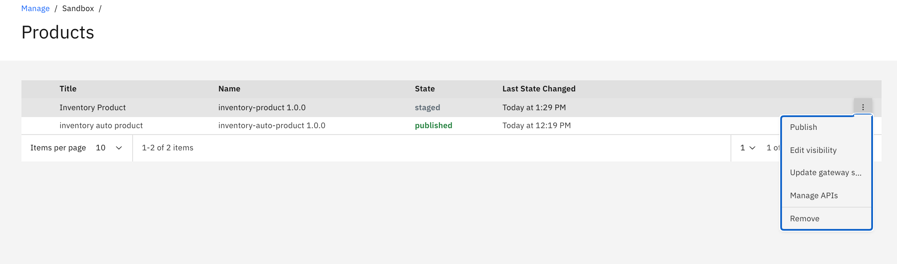

5. Select the **[Think
Inventory]** product, as this is the one
which will supersede Inventory APIs .

    

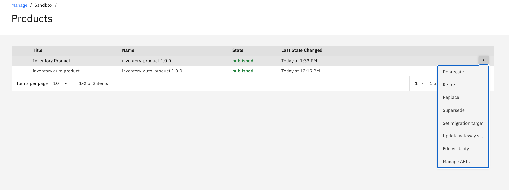

6. Click **[Next]** in the bottom.

7. In order to maintain our consumers' entitlements, we need to migrate
their plan subscriptions.

    Both of our Products have plans called**[ Default
Plan.]** You will now choose to move
subscribers from the Inventory Product's default plan to the Think
Inventory Product's default plan.

    In the drop-down menu, select Default Plan and then
click [[Supersede]].

   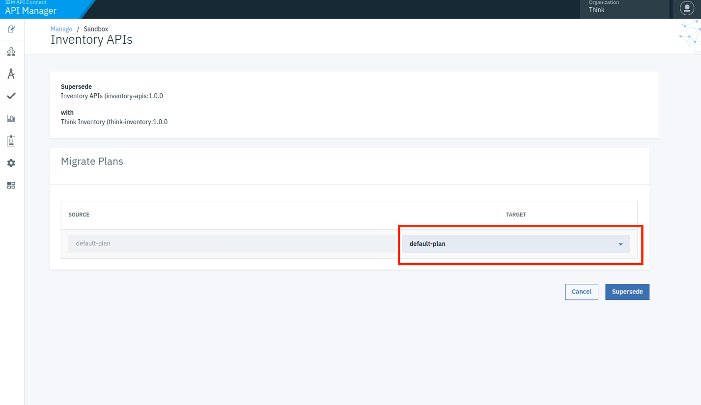

8. API Connect will take care of deprecating the old product and
publishing the new one. As a result, the new **Think Inventory** product
will be published, while the old one will be automatically deprecated.

    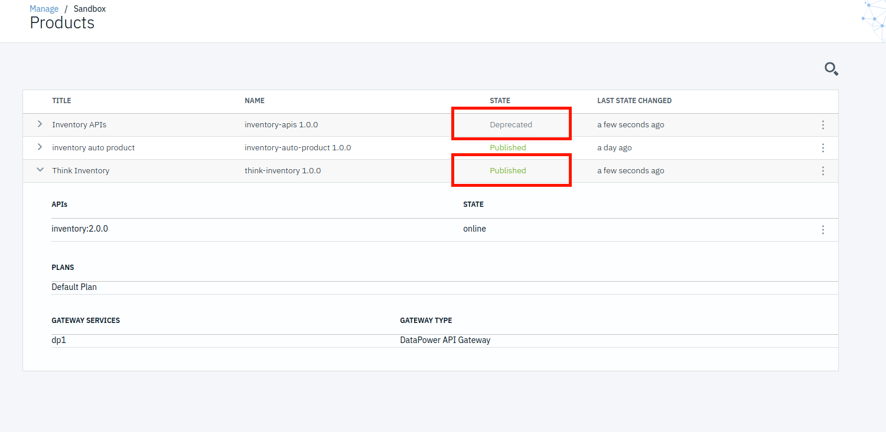

 Test the OAuth Configuration
===================================================================================

In this section, you will test the new version of the API to ensure that
OAuth is working properly.

1.  Open your API Portal in a new browser tab and log in with your
    developer account. 

2.  Click the **[API Products]** tab.

3.  Notice that the old **[Inventory
    APIs]** product is no longer available.
    It has been replaced by your new **[Think
    Inventory]** product.

4.  Click on the **[ Inventory
    Product]**. **Note:** There is no need
    to re-subscribe your application to the plan. By
    using **[Replace]** as the state change
    control, your subscription was automatically migrated. As a result,
    you're already entitled to the API's contained in the new Product's
    Default Plan - including the O-Auth API.

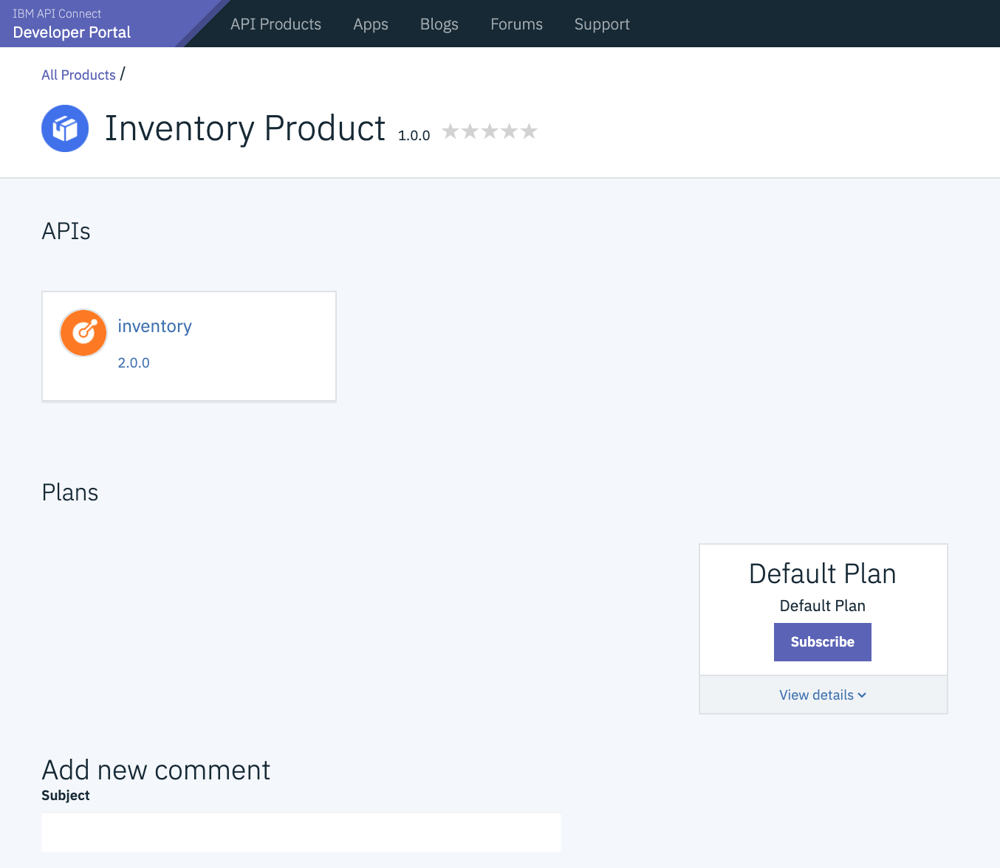

5.  Select Subscribe Default Plan and then select IBM Consumer App to
    subscribe the app.

6.  Click on the **[inventory API]** from
    the palette menu on the left.

7.  Select the **[GET /Items]** operation
    and click on the **[Try It ]**button at
    the top. Notice that we now have an additional OAuth security
    requirement defined.    

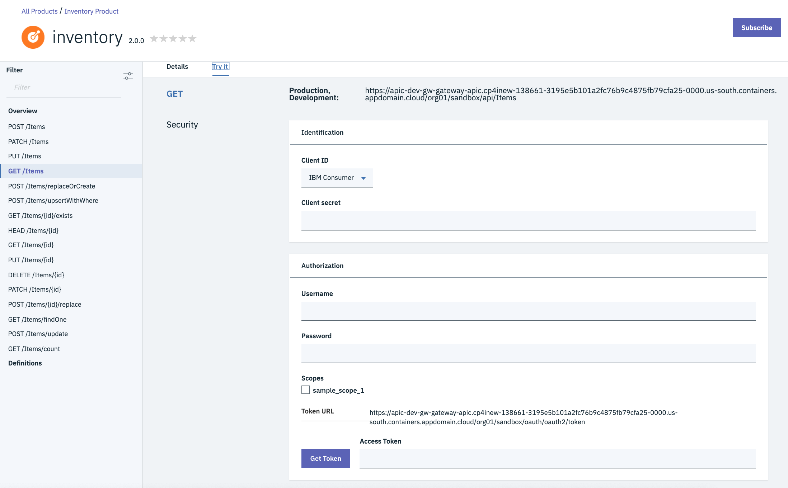

8.  Scroll down to browse the invocation form.

9.  Select your subscribed application from the **[Client
    ID]** drop-down menu.

10. Paste your secret into the **[Client
    secret ]**field.

11. In
    the **[Username]** and **[Password]** fields,
    you can enter any text. Select the inventory scope. **Note:** 
    Recall that when we configured the OAuth API, we provided an
    Authentication URL as the method for validating the user
    credentials. The URL that we provided will respond back OK with any
    credentials.

12. Click the **[Get Token]** button to
    obtain an OAuth token. 

    -   The API Portal will call out to the OAuth Token URL with your
        client credentials and user credentials.

    -   The OAuth API which you built in lab 3 will intercept the
        request, validate the credentials, and generate a token.  

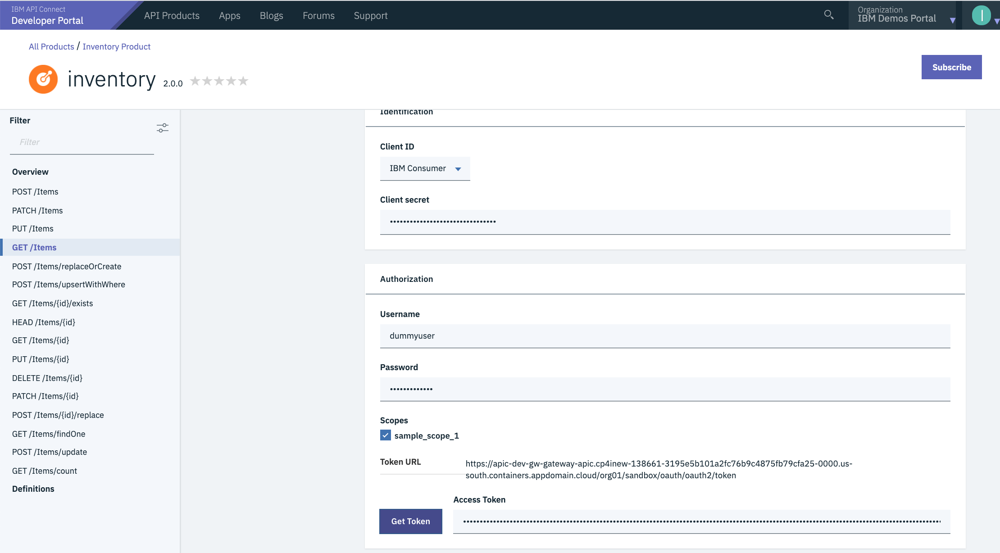

13. Click the **[Send]** button to invoke
    the API. The request will include the OAuth bearer token in
    the **[Authorization]** header.

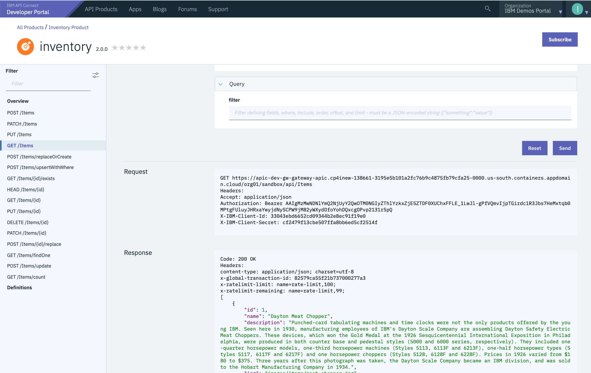

14. To prove that the token is being validated, you can either remove or
    modify the contents of the **[Access
    Token]** field. Then click
    the **[Send]** button again and see
    the **401 Unauthorized **error response.

 Summary
==============================================================

You completed the APIC Dev Jam Lab 4 - Use Lifecycle Controls to Version
your API. Throughout the tutorial, you explored the key takeaways:   

-   Create a new API Product.

-   Supercede the Old Product.

-   Test Your OAuth API in the Developer Portal.

Continue the APIC Dev Jam! Go to[ APIC Dev Jam - Lab 5 - Advanced API
Assembly](https://integrationsuperhero.github.io/techcon2020/APICDevJam/Lab5) to
learn about adding business logic to the API Gateway through the use of
policies. 
