**APIC Dev Jam Lab 5 - Advanced API Assembly**

::: 
::: 
**Table of Contents**
:::

***[APIC Dev Jam Series 2](#__RefHeading___Toc958_3207436410)***

[Prerequisites: Labs 1-4 2](#__RefHeading___Toc960_3207436410)

***[Create and Define the Financing API (REST to SOAP)
2](#__RefHeading___Toc962_3207436410)***

***[Map the API to a Service WSDL
12](#__RefHeading___Toc964_3207436410)***

**[Attach a Service WSDL 12](#__RefHeading___Toc966_3207436410)**

**[Build the Financing API Assembly
14](#__RefHeading___Toc968_3207436410)**

***[Import Logistics API 22](#__RefHeading___Toc970_3207436410)***

**[Import the OpenAPI Definition
22](#__RefHeading___Toc972_3207436410)**

**[Configure payload to be stored in Analytics
24](#__RefHeading___Toc974_3207436410)**

***[Create an Orchestration Assembly
24](#__RefHeading___Toc976_3207436410)***

**[Create the Logistics API Assembly
25](#__RefHeading___Toc978_3207436410)**

**[Configure the \`shipping.calc\` Case
26](#__RefHeading___Toc980_3207436410)**

***[Use GatewayScript in an Assembly
31](#__RefHeading___Toc982_3207436410)***

**[Configure the \`get.stores\` Case
32](#__RefHeading___Toc984_3207436410)**

***[Summary 36](#__RefHeading___Toc986_3207436410)***
:::

In the previous labs, you have been working with an API that acts as a
pass-through to a microservice application.

 

In this lab, you will expand the product offerings for ThinkIBM. In
addition to the Inventory API, ThinkIBM wishes to provide APIs that
offer financing and shipping logistics to consumer applications. Your
goal is to utilize existing enterprise and public assets to create these
API offerings.

In this tutorial, you will explore the following key capabilities:

-   Create a new API, including object definitions and paths.

-   Configure an API to access an existing SOAP service.

-   Import an existing API from an OpenAPI definition document (a.k.a
    Swagger).

-   Map data retrieved from multiple API calls into an aggregate
    response.

-   Use GatewayScript directly within an API assembly.

[] APIC Dev Jam Series 
===================================================================================================================================================================================================================================

The APIC Dev Jam Series is a hands-on workshop with lab exercises that
walk you through designing, publishing, and securing APIs. This workshop
is for API developers, architects, and line of business people who want
to create a successful API strategy. There are 8 labs and each is 30
minutes long. Make sure you choose enough time in your reservation to
get through all the labs! 

 

[NOTE: ]**[This demo environment contains a
full API Connect installation in Cloud Pak for Integration. The login
information to the APIC cluster will be sent in a separate email when
you reserve the instance. Use Google Chrome, Firefox or Microsoft Edge
to access the cluster using the credentials supplied. Make sure you
login using API Manager User Registry not Common Services
registry.]**

[Lab 1 : Create and Secure an API to Proxy an Existing REST Web
service](https://ibm.biz/TechConLabs/APICDevJam/Lab1)

[Lab 2 : The Developer Portal
Experience](https://ibm.biz/TechConLabs/APICDevJam/Lab2)

[Lab 3 : Add OAuth Security to your
API](https://ibm.biz/TechConLabs/APICDevJam/Lab3)

[Lab 4 : Use Lifecycle Controls to Version Your
API](https://ibm.biz/TechConLabs/APICDevJam/Lab4)

[Lab 5: Advanced API
Assembly](https://ibm.biz/TechConLabs/APICDevJam/Lab5)

[Lab 6: Working with API
Products](https://ibm.biz/TechConLabs/APICDevJam/Lab6)

[Lab 7: The Consumer
Experience](https://ibm.biz/TechConLabs/APICDevJam/Lab7)

[Lab 8: Create and test GraphQL Proxy
API](https://ibm.biz/TechConLabs/APICDevJam/Lab8)

[]
Prerequisites: Labs 1-4

 Create and Define the Financing API (REST to SOAP) 
=========================================================================================================

ThinkIBM wants to give its customers the ability to calculate financing
payments. There is already a legacy SOAP-based application which will do
the calculation, but it should be exposed to consumers as a modern
RESTful API. In this section, you will create a new OpenAPI definition
for the financing API.

1\. From the left navigation menu,
click **[Develop.]**

2\. Click **[Add]** and
choose **[API]**.

    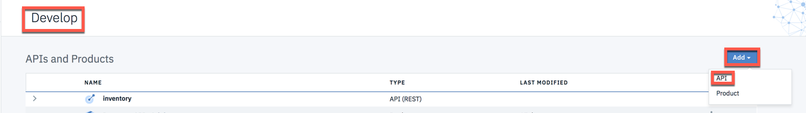

3\. Select **[New OpenAPI]** and
click [[Next.]]

    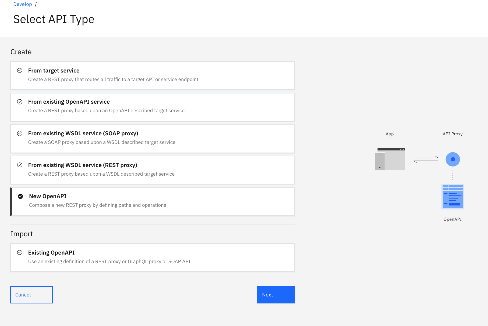

4. Fill in the form for **Create New OpenAPI** with the following
values: 

    **[Title: financing]**

  **Name: financing**

  **Base Path: /financing**

  **Version: 1.0.0**

[[  ]]Click **Next**.

    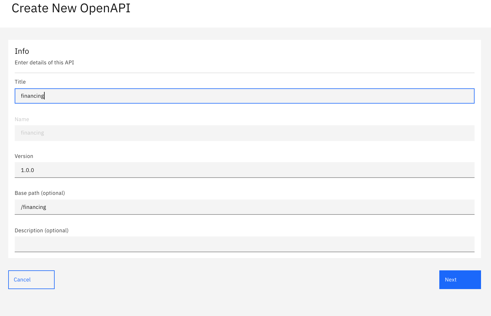

5\. Leave all default values and
click [[Next. ]]API
Connect will generate a new OpenAPI definition for the financing API and
provide a summary with the performed activities.

[[  ]]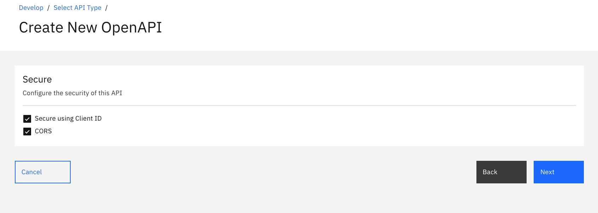

6. Click  **[Edit API ]**to customize the
API.

[[  ]]

7. Create the model definition for the new API. These definitions are
used in a few places. Their primary role is to serve as documentation in
the developer portal on expected input and output parameters. However,
they can also be used for data mapping actions.
Click **[Definitions]** from the API
Designer menu on the left. Then,
click **[Add]** to create a new definition.

     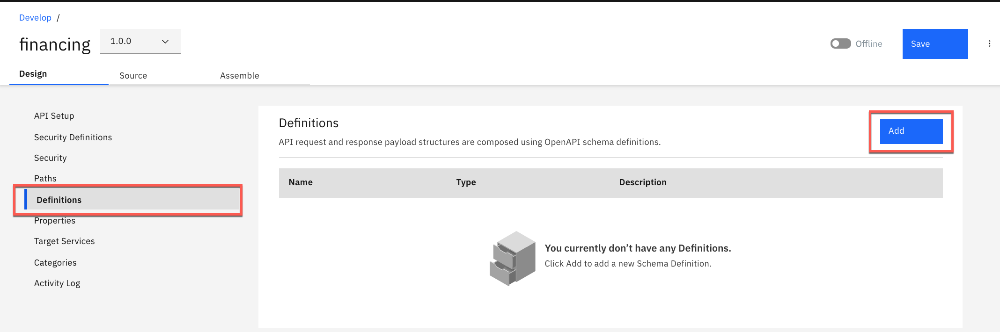

8. Enter **[paymentAmount]** for **[Name]** and
leave the definition **[Type]** set
to **[object]**.

9\. Click **[Add]** in
the **[Properties]** section.

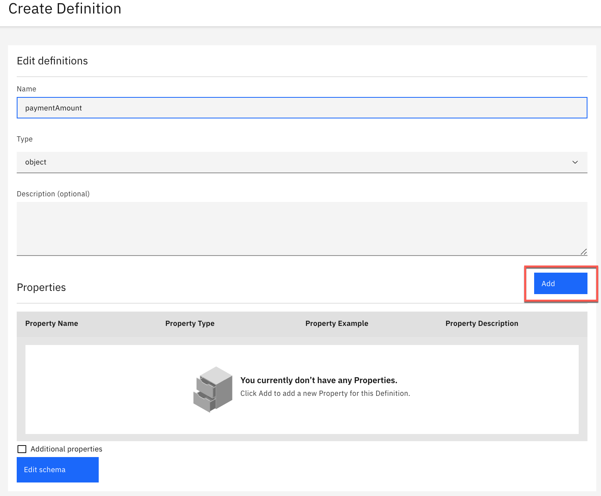

10\. Edit the **property values** using the following values:

   **Property Name: paymentAmount**

   **Type: float**

   **Example: 199.99**

   **Description: Monthly payment amount**

      The page will look like this:

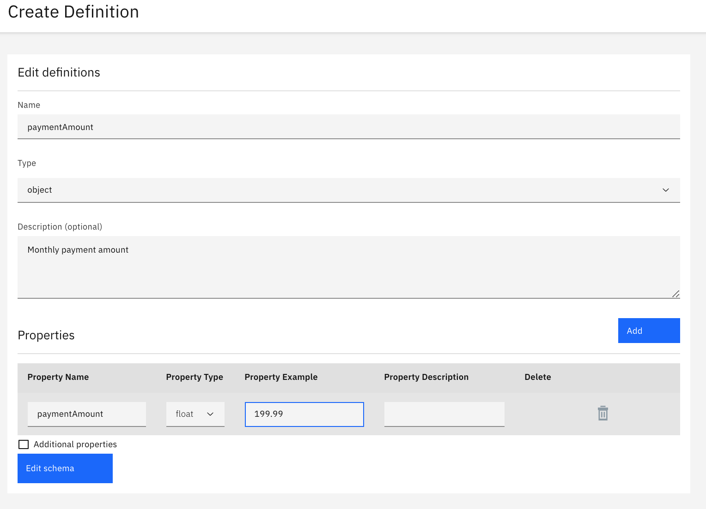

The property will be utilized in the Path you create next.
Click **[Save]** to go back to the main API
Editor.

11\.
Click [[Paths]] in
the navigation menu on the left. Then
click **[Add]** to create a new path.

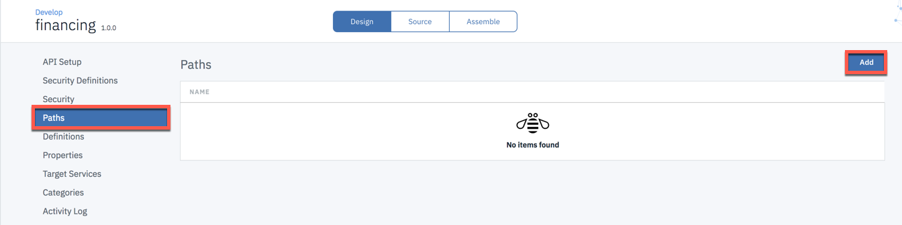

12\. The Path screen is loaded. Edit the [[Path
name]] to
be **[/calculate]**.

      **[Note:]** **[Recall that our Base
Path for this API is \`/financing\`. This new path will be appended to
the base, creating a final path of       
 /financing/calculate.]**

13\.
Click [[Add]] in
the Operations section to define the operation to support under the
path.

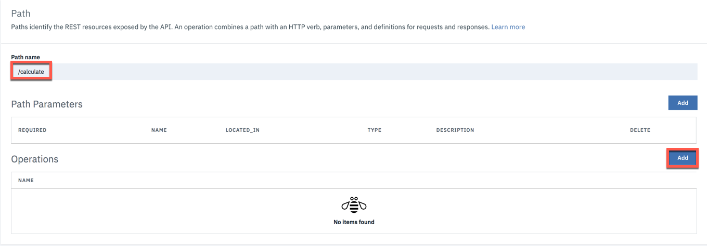

14\. From the **[Add Operation]** menu,
select the **[Get]** operation and then
click **[Add]**. 

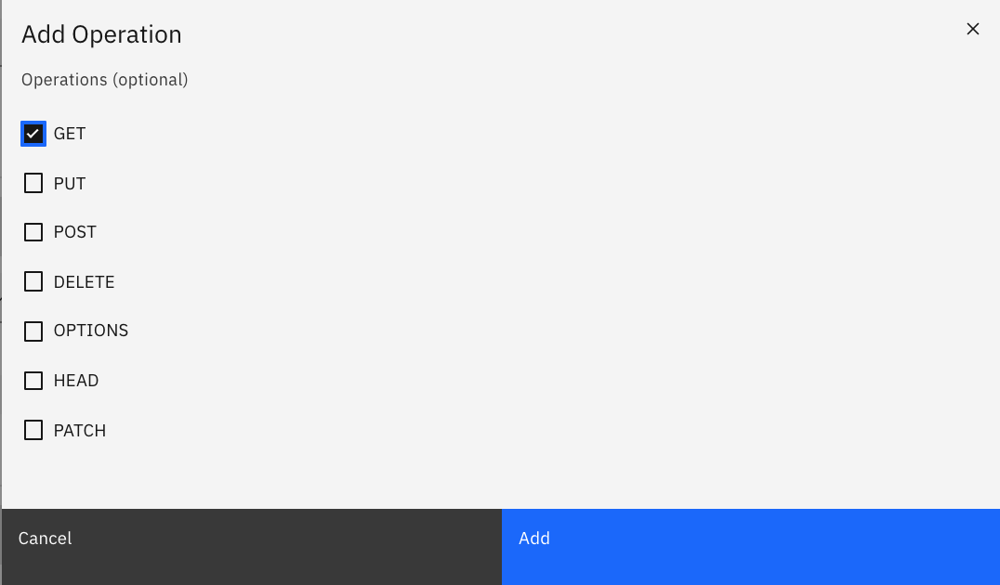

15\. Click **[Save]**. You will be
redirected to the main API Editor to continue.

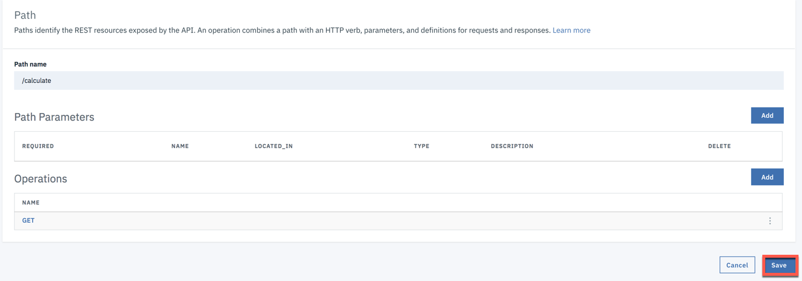

16\. Click the **[/calculate]** path we
just created.

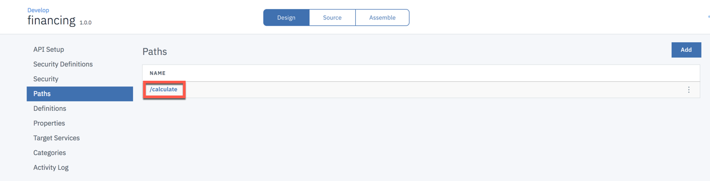

17\. Click the **[GET]** operation to add
the request parameters. This defines the input to the API request. Since
this is a GET request, you will add the required request parameters to
the query component of the URI.

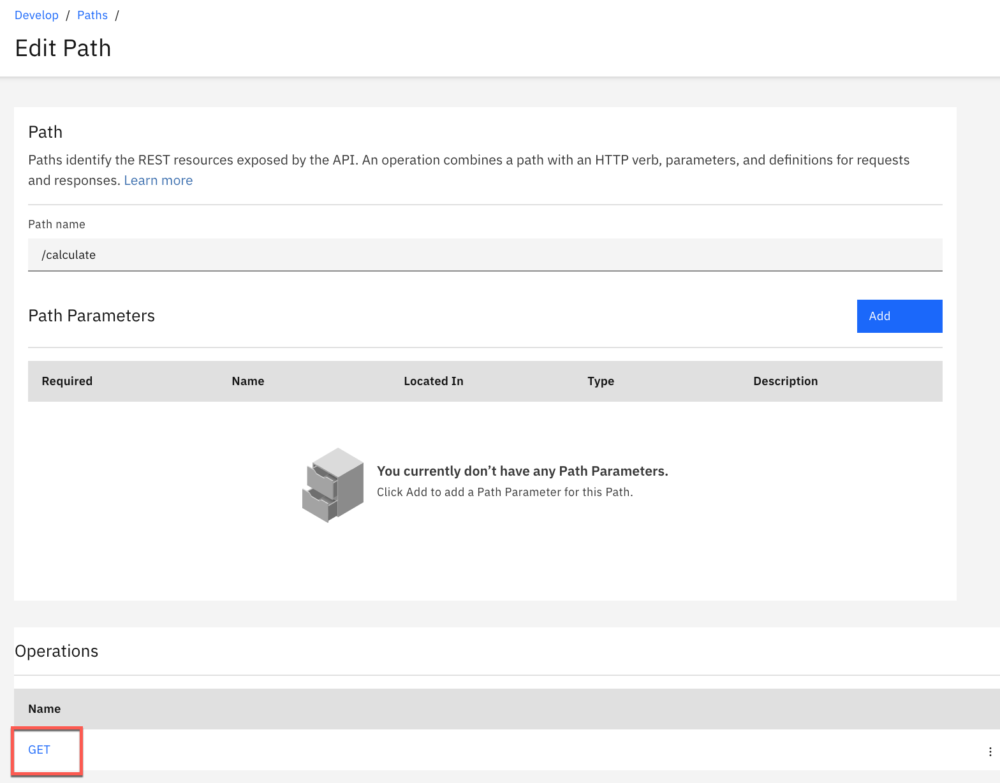

18\. Scroll down to the Parameters section within the operation config.
Click
 [[Add]] in
the [[Parameters]] section.
You are actually going to need three total parameters for this
operation, so go ahead and click the \`**Add**\` button **two more
times** to add the parameter templates.

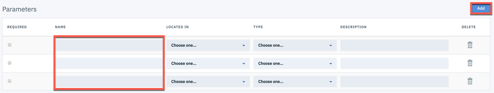

19\. Edit the **parameters** to set the values:

  **Required**   **Name**   **Located In**   **Type**   **Description**
  -------------- ---------- ---------------- ---------- --------------------------
  yes            amount     Query            float      amount to finance
  yes            duration   Query            int 32     length of term in months
  yes            rate       Query            float      interest rate

Once you have entered the values, the screen will look like this:

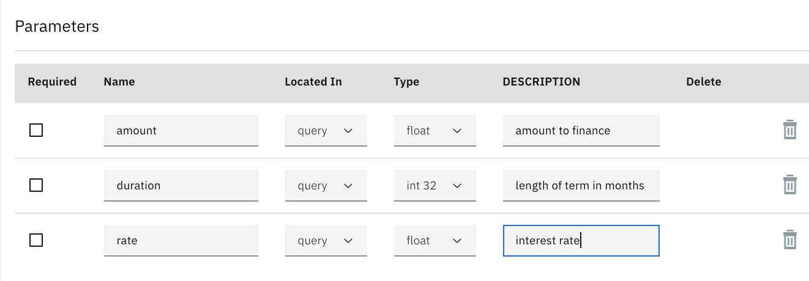

20\. Set the schema for the response. Click **Add** in
the **[Response]** section.
Enter [[200]] for [[STATUS
CODE]].
Since we already defined
the **[paymentAmount]** definition, select
it from the drop down list
for [[SCHEMA]].
You will find
the **[paymentAmount]** definition at the
bottom of the list.
For [[DESCRIPTION]] enter [[amount
calculated
successfully]]
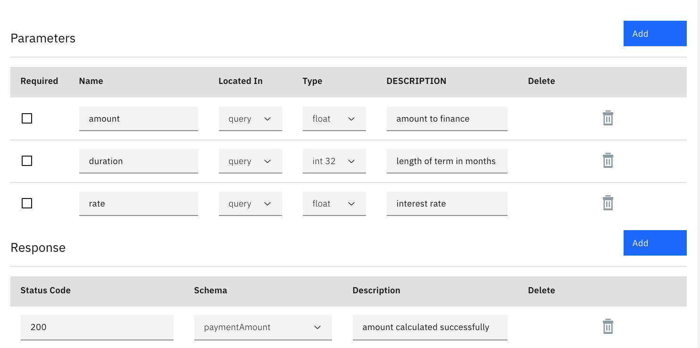

21\.
Click [[Save]] to
save the API definition.

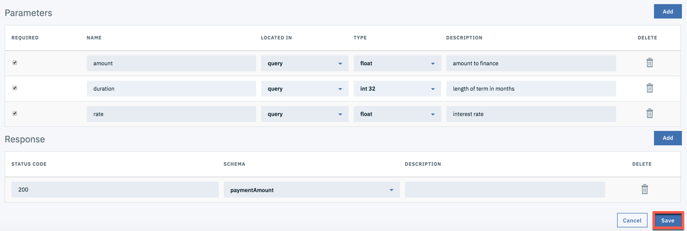

 Map the API to a Service WSDL 
====================================================================================

Import the legacy Financing SOAP service WSDL and map it to the RESTful
API definition.

 [Attach a Service WSDL] 
-----------------------------------------------------------------------------------------------------------------------------------------

1.  Click the **[Target Services]** option
    in the left column menu palette from the **[financing
    1.0.0]** API Design screen

2.  Click **[Add]** to import the web
    service from the legacy financing service.

3.  Click **[Browse]** to
    select [[calculate.wsdl]] located
    in /home/sysadmin/.

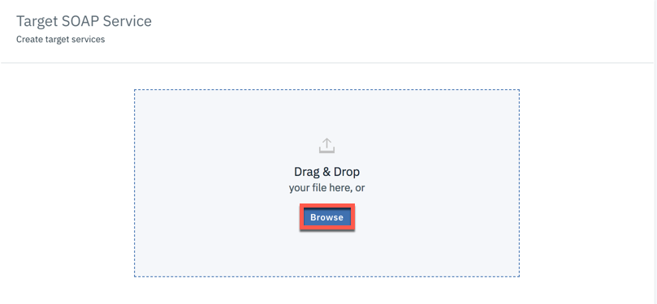

   You will get a success message and the service included in the WSDL
will be displayed.

   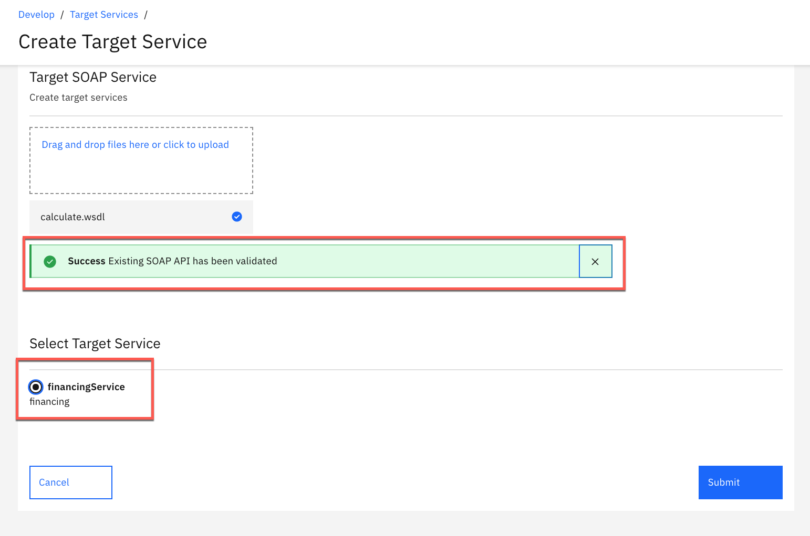

5\. Select **[financingService.]** Then
click **[Submit]**.

 [Build the Financing API Assembly] 
----------------------------------------------------------------------------------------------------------------------------------------------------

1\.
Click [[Assemble]] to
access the assembly editor.

2\. In the processing pipeline, mouse over
the [[invoke]] policy
and click
the [[trashcan]] icon
to delete it.

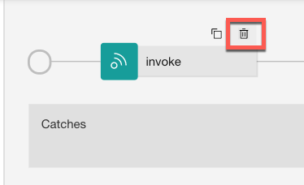

3\. Scroll down to the bottom of the policy menu and drag and drop
the **[financing web service
operations]** to processing pipeline.

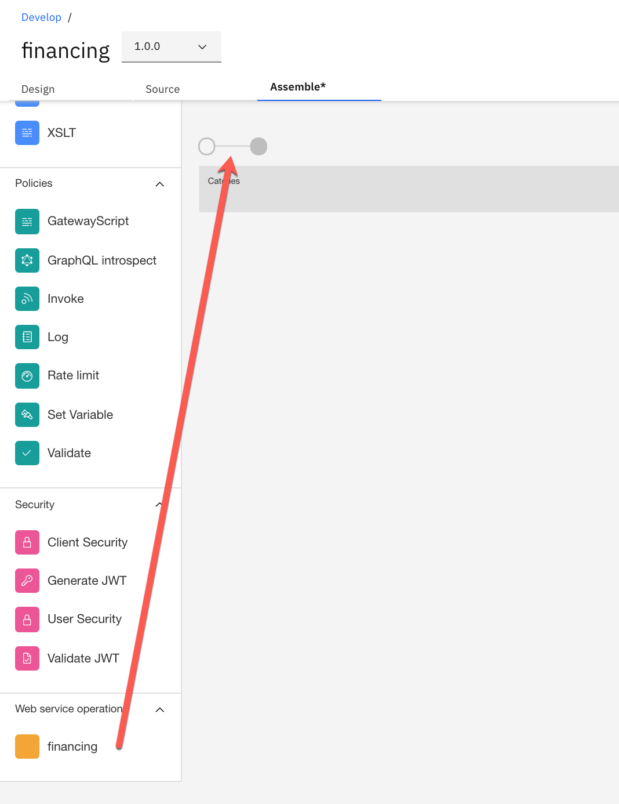

4\. Now you are going to modify the input and output map policy for
mapping your REST API into SOAP.

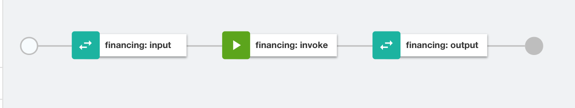

5\. Since we are using the new API Gateway, we will need to instruct it
to use the newer version of the policies in the flow (map, invoke, map).
Click Source to go to the OpenAPI definition of your API.

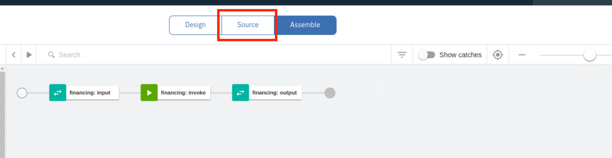

6\. Scroll down to map and insert [[version:
2.0.0]] right
below it. 

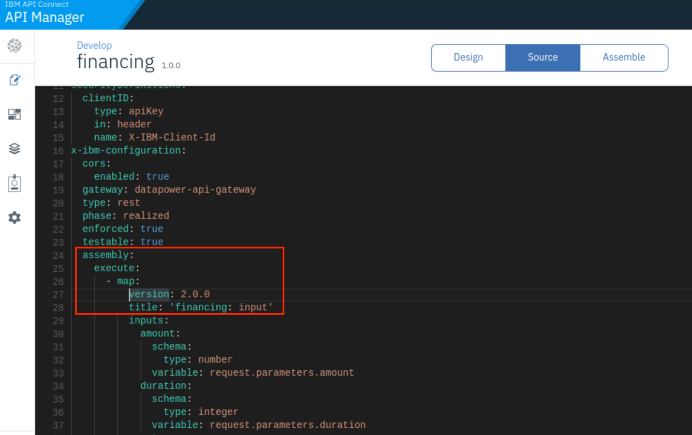

7\. Scroll down to invoke and insert [[version
2.0.0]] right
below it. 

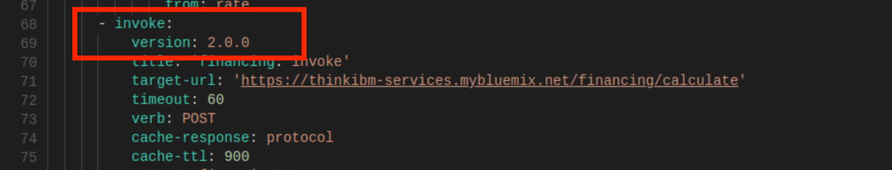

8\. Now go to the last map and insert **[version:
2.0.0]** right below it.
Click [[Assemble]] to
go back to the gateway flow designer.

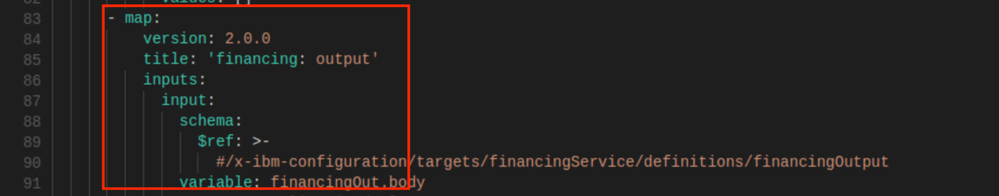

9\. In order to consume a SOAP-based service from your REST-based API,
you need to map the query parameter inputs that were previously defined
as part of the GET /calculate operation to a SOAP payload. To do so,
click the [[financing
input]] map
policy on our pipeline to open the map editor.

    [[Tip: Click on the \`+\` icon to make the editor window fill the
screen.]]

10\. Click on
the [[pencil icon]] in
the [[Input column]].

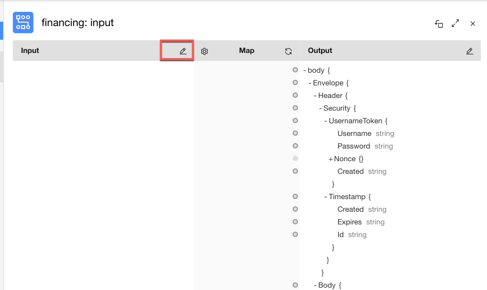

11\. Click [[+ parameters for
operation\...]] and
select the **[GET Calculate operation]**.

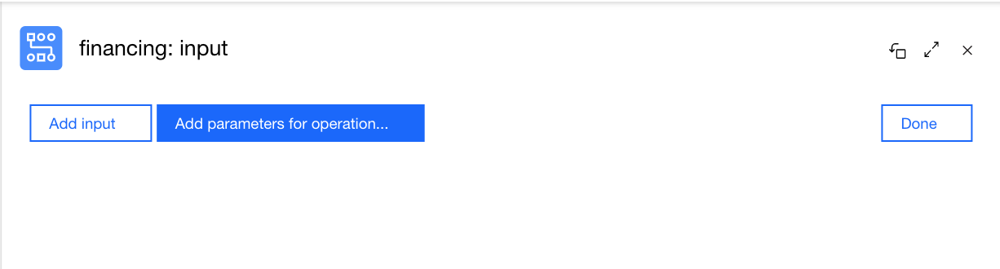

    The Map editor will automatically pull in the request parameters
that you defined earlier.

12\. Click **[Done]** to return to the map
editor.

13\. For each of the Input query parameters, map them to their
respective SOAP Output elements.

    To map from an input field to an output field, click the circle next
to the source element once, then click the circle next to the target
element. A line will be drawn between the two, indicating a mapping from
the source to the target.

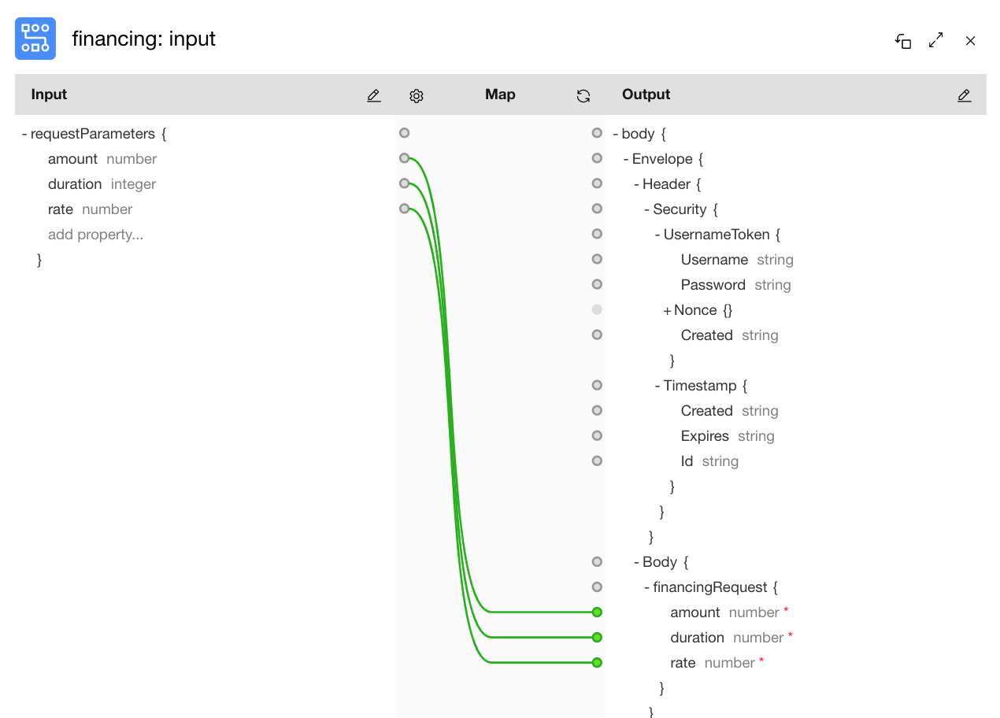

14\.
Click [[\`X\`]] in
the map editor to return to the policy pipeline.

15\. Click
the [[invoke policy]] to
open its editor.

16\. The SOAP service URL has already been set for you during the
service import when we create the API.

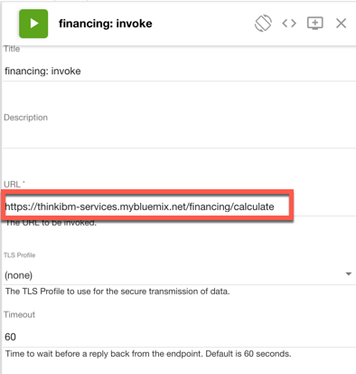

17\.
Click [[\`X\`]] to
return to the policy pipeline.

18\. After the Financing Web Service is invoked, you need to map the
SOAP response into a JSON object.

      You already defined the response object
called [[paymentAmount]].
To do the map, click the **[financing
output]** map policy on the pipeline to
open the map editor.

19\. Click
the [[pencil icon]] to
set the output object schema.

20\. Click the **[+ outputs for
operation\...]** option and select
the [[GET
/calculate operation]].

21\. Set the [[Content
type]] configuration
option
to [[application/json]],
and then
click [[Done]] to
return to the map editor.

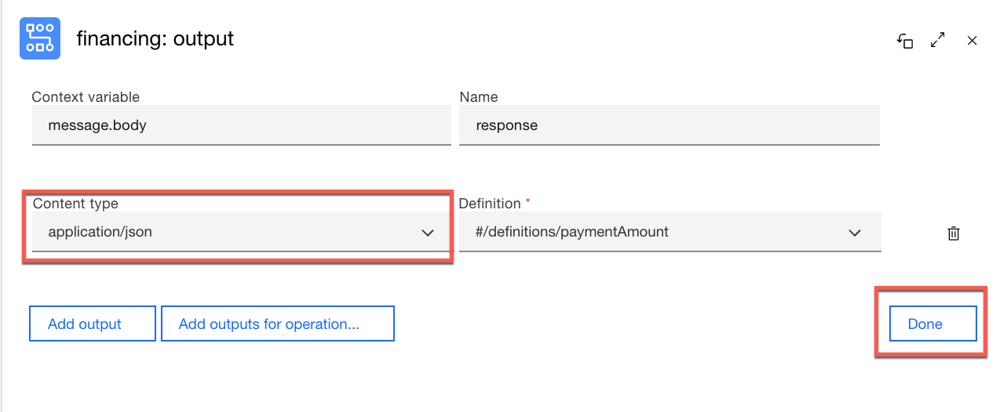

22\. Click the [[circle next to the paymentAmount source
element]] once,
then click the [[circle next to the target
element]].
A line will be drawn between the two, indicating a mapping from the
source to the target.

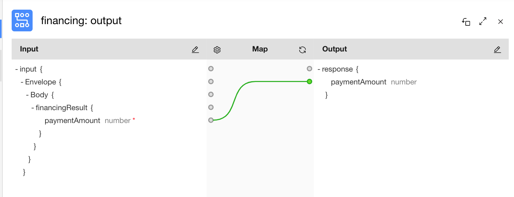

23\.
Click [[\`X\`]] in
the map editor to return to the policy pipeline.

24\.
Click [[Save]] the
API definition.

25\. Click **[Develop]** in the navigation
menu to return to the list of APIs and Products in your system.

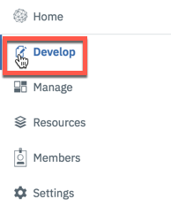

 Import Logistics API 
===========================================================================

In this lab section, we will be adding a new API called logistics which
will provide helper services around calculating shipping rates and
locating nearby stores. Rather than require you to build the entire API
from scratch again, you will see how you can import and modify an
existing OpenAPI definition.

 [Import the OpenAPI Definition] 
-------------------------------------------------------------------------------------------------------------------------------------------------

1.  Click **[Add]** and
    select **[API.]**  

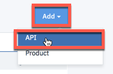

2.  From the Create API wizard, select [[Import: Existing
    OpenAPI]].
    Then
    click [[Next]].  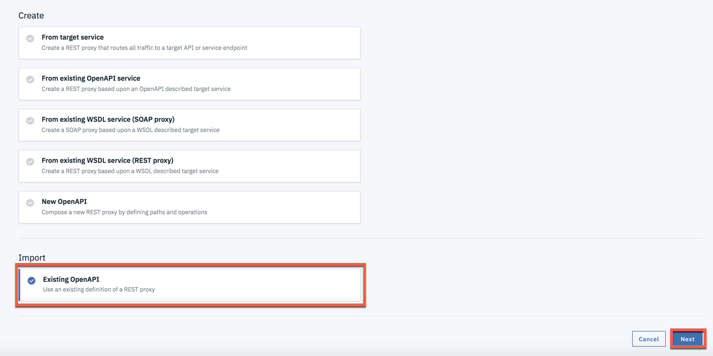

3.  Click \`**Browse**\` in the [[Import from
    file]] window,
    navigate to /home/sysadmin/, and
    choose [[logistics.yaml.]]  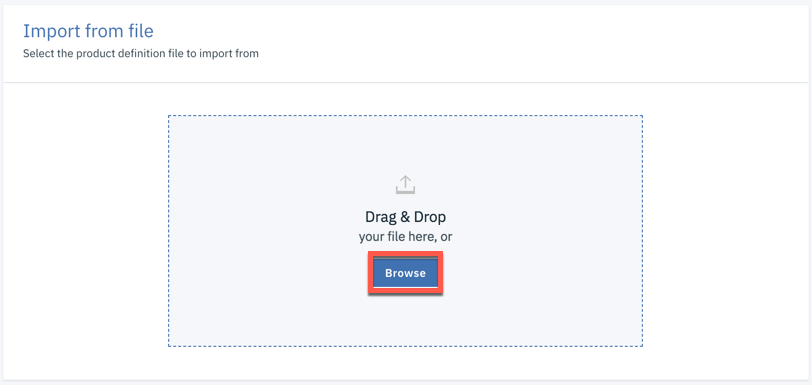

4.  Click [[Next]] in
    the confirmation window.

5.  Click [[Next]] one
    more time [[without selecting the option Activate
    API]] since
    we still need to make some updates.

6.  Click [[Edit
    API]] in
    the [[Summary]] page
    to go to the API editor.

 [Configure payload to be stored in Analytics] 
---------------------------------------------------------------------------------------------------------------------------------------------------------------

1.  From the API menu, select [[Activity
    Log]].
    In
    the [[Content]] drop-down,
    select [[payload]].
    A pop up window will be displayed, asking to enable buffering.
    Click [[Continue]].

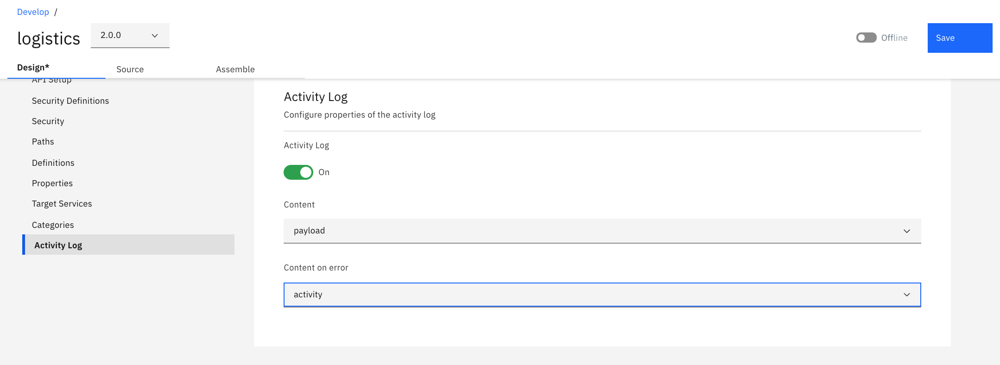

2.  Set the [[Content on
    error]] drop-down
    to [[payload]].
    Click [[Save]].

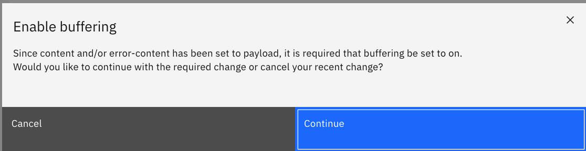

 Create an Orchestration Assembly 
=======================================================================================

The logistics API provides resources for calculating shipping costs and
locating the nearest store for pickup. In this section, you will
configure the assembly for the shipping calculation resource. Your API
assembly will call out to two separate shipping vendors and provide a
consolidated response back to the consumer.

 [Create the Logistics API Assembly] 
-----------------------------------------------------------------------------------------------------------------------------------------------------

1.  Switch to
    the [[Assemble]] tab
    and remove
    the [[invoke]] policy
    by hovering over it and selecting the [[trashcan
    icon]].

2.  Click and drag
    the [[switch]] policy
    to flow pipeline in the right.

3.  The switch editor will open with a single case with case 0 created
    by default.

4.  Next to case 0, click **[search
    operations\...]** to show the drop-down
    list of available operations.

5.  Select
    the **[shipping.calc]** operation.

6.  Click the **[+ Case]** button to add a
    second case for
    the [[get.stores]] operation.

7.  Click **[X]** to close the operation
    switch configuration editor and then
    click [[Save]].
    You should see two new processing pipelines created on your
    \`operation-switch\` step - one for each case:

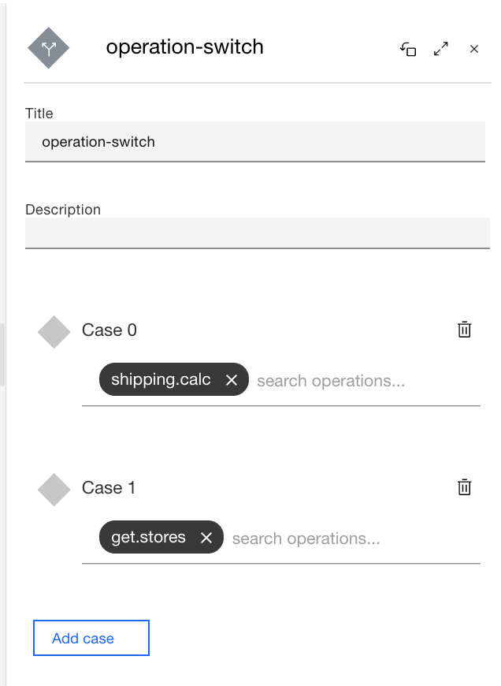

 

 [Configure the \`shipping.calc\` Case] 
--------------------------------------------------------------------------------------------------------------------------------------------------------

This operation will end up invoking two separate back-end services to
acquire shipping rates for the respective companies, then utilize a map
action to combine the two separate responses back into a single,
consolidated message for our consumers.

1.  Add an [[invoke
    policy]] to
    the [[shipping.calc case]].

2.  Edit the **[invoke]** action with the
    following properties:

    -   [[Title:
        invoke\_xyz]]

    -   [[URL:
        \$(shipping\_svc\_url)?company=xyz&from\_zip=90210&to\_zip=]]

    -   [[Stop on error:
        unchecked]]

    -   [[Response object variable (scroll to the bottom):
        xyz\_response]]  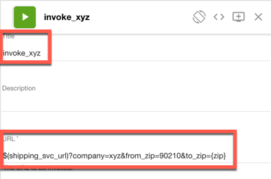  
         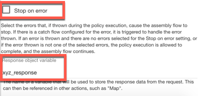

    -   **[Note: The  parameter provided here is a reference to the
        zip parameter defined as input to the operation. The 
        portion of the URL will get replaced by the actual zip code
        provided by the API consumers. ]**

3.  Hover over
    the [[invoke\_xyz policy]] and
    click [[clone]] to
    add another invoke action:  

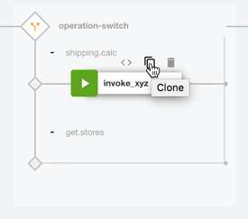  

4.  Edit the new invoke policy with the following properties:

    -   [[Title:
        invoke\_cek]]

    -   [[URL:
        \$(shipping\_svc\_url)?company=cek&from\_zip=90210&to\_zip= ]]

    -   [[Response object variable:
        cek\_response]]  

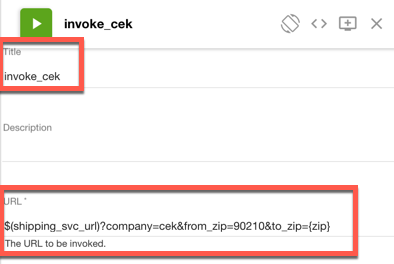

 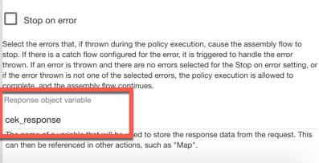

5.  Add
    a [[map policy]] after
    the last invoke and then click it to open the
    editor.  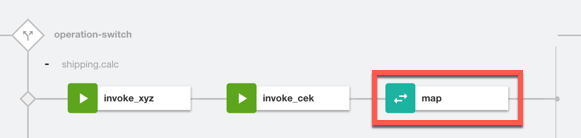  

6.  Click
    the [[pencil]] at
    the top of the Input column, then click on the [[+
    input]] button.
    Enter the following input configuration:

    -   [[Context variable:
        xyz\_response.body]]

    -   [[Name:
        xyz]]

    -   [[Content type:
        application/json]]

    -   [[Definition:
        \#/definitions/xyz\_shipping\_rsp]]

7.  Click the [[+
    input]] button
    again to add another input. Specify the following input
    configuration:

    -   [[Context variable:
        cek\_response.body]]

    -   [[Name:
        cek]]

    -   [[Content type:
        application/json]]

    -   [[Definition:
        \#/definitions/cek\_shipping\_rsp]]

8.  You now have two inputs assigned to the
    map policy:  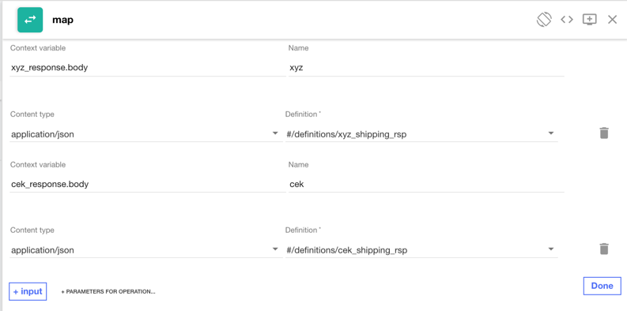

9.  Click [[Done]] to
    return to the editor.

10. Click the [[pencil
    icon]] at
    the top of
    the [[Output]] column
    and then click [[+ outputs for
    operation\...]] and
    choose
    the [[shipping.calc]] operation.

11. Set **[Content
    type]** to [[application/json]].

12. Click [[Done]] to
    return to the editor.

13. Complete the mapping. To map from an input field to an output field,
    click the circle next to the source element once, then click the
    circle next to the target element. A line will be drawn between the
    two, indicating a mapping from the source to the
    target. 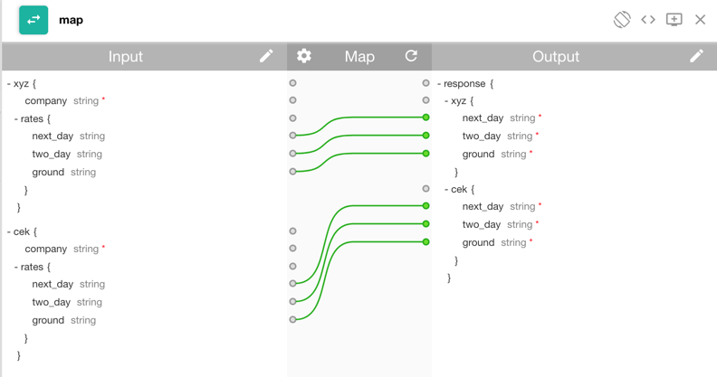

14. Click **X** to close the map editor. Your assembly policy for the
    shipping.calc operation is now complete.

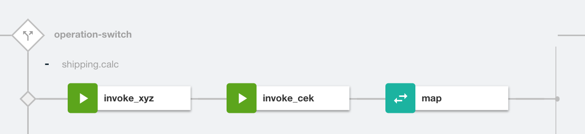

15\. Save your changes.

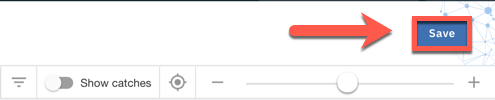

 Use GatewayScript in an Assembly 
=======================================================================================

In this section, you will configure the assembly for the store locator
resource. You will use GatewayScript to modify the response to your
consumers, providing them a maps link to the nearest store location.

 [Configure the \`get.stores\` Case] 
-----------------------------------------------------------------------------------------------------------------------------------------------------

This operation will call out to the Google Geocode API to obtain
location information about the provided zip code, and will then utilize
a simple gatewayscript to modify the response and provide a formatted
Google Maps link.

1.  Add an invoke policy to
    the [[get.stores case]].  

2.  Edit the
    new [[invoke action]] with
    the following properties:

    -   [[Title:
        invoke\_google\_geolocate  ]]

    -   [[URL:
        https://maps.googleapis.com/maps/api/geocode/json?&address=]]

    -   [[Stop on error:
        unchecked ]]

    -   [[Response object variable (scroll to the bottom):
        google\_geocode\_response]]  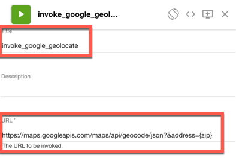  
          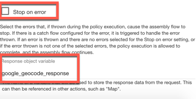

3.  Click [[X]] to
    close the invoke editor.

4.  Add
    a [[gatewayscript policy]] with
    the following properties:

    -   **[Title:
        gws\_format\_maps\_link]**

    -   Copy the following GatewayScript snippet and paste it into the
        text area:

[[// Save the Google Geocode response body to
variable]]

[[var mapsApiRsp =
apim.getvariable(\'google\_geocode\_response.body\');]]

[[ 
 ]]

[[// Get location attributes from geocode response
body]]

[[var location =
mapsApiRsp.results\[0\].geometry.location;]]

[[ 
 ]]

[[// Set up the response data object, concat the latitude and
longitude]]

[[var rspObj = ;]]

[ ]

[[// Save the output
    ]]

[[apim.setvariable(\'message.body\',
rspObj)]]

-   **[Note: Take a quick look at line 5. Notice how our gateway script
    file is reading the body portion of the google\_geocode\_response
    variable which was assigned to the output of the invoke
    action.]**

Click [[X]] to
close the gatewayscript editor.

Your assembly for the \`logistics\` API will now include two separate
operation policies:  

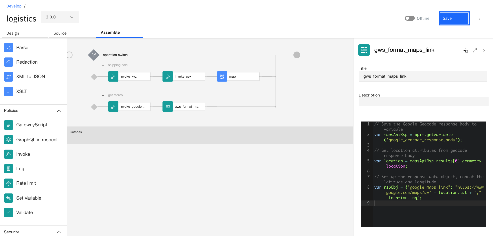

7.  **Save** your
    changes.  

8.  Click [[Develop]] in
    the navigation menu to return to the list of APIs and Products in
    your system.

 Summary 
==============================================================

Congratulations! You have successfully configured two new API's with
advanced assemblies. Throughout the tutorial, you explored the key
takeaways:

-   Create a new API, including object definitions and paths.

-   Configure an API to access an existing SOAP service.

-   Import an existing API from an OpenAPI definition document (a.k.a
    Swagger).

-   Map data retrieved from multiple API calls into an aggregate
    response.

-   Use GatewayScript directly within an API assembly.

Continue with the APIC Dev Jam! Go
to[[ ](https://ibm.com/cloud/garage/dte/tutorial/apic-v2018-dev-jam-lab-5-advanced-api-assembly)[APIC
Dev Jam - Lab 6 - Working with API
Products](https://ibm.com/cloud/garage/dte/tutorial/apic-v2018-dev-jam-lab-6-working-with-api-products)] to
learn about bundling the API's into a Product and publishing it to the
consumer portal.
