**APIC Dev Jam - Lab 8 -- Creating GraphQL Proxy API**

In this lab, you will explore the how to define GraphQL APIs that proxy
to a backend GraphQL server. GraphQL is a query language for APIs that
gives an application client greater control over what data it retrieves
in an API request when compared with a REST API request.

API Connect GraphQL support also allows rate limiting and other controls
using API Gateway.

In this tutorial, you will explore the following key capabilities:

-   Create a GraphQL Proxy API

-   Learn about GraphQL introspection and Schema Editor

-   Test APIs by using the built-in GraphQL editor

-   Review API Assembly Policies for the cost end point

APIC Dev Jam Series
=======================================================================================================================================================================================================================================================================================================

The APIC Dev Jam Series is a hands-on workshop with lab exercises that
walk you through designing, publishing, and securing APIs. This workshop
is for API developers, architects, and line of business people who want
to create a successful API strategy. There are 8 labs and each is 30
minutes long. Make sure you choose enough time in your reservation to
get through all the labs! 

 

[NOTE: ]**[This demo environment contains a
full API Connect installation in Cloud Pak for Integration. The login
information to the APIC cluster will be sent in a separate email when
you reserve the instance. Use Google Chrome, Firefox or Microsoft Edge
to access the cluster using the credentials supplied. Make sure you
login using API Manager User Registry not Common Services
registry.]**

[Lab 1 : Create and Secure an API to Proxy an Existing REST Web
service](https://integrationsuperhero.github.io/techcon2020/APICDevJam/Lab1)

[Lab 2 : The Developer Portal
Experience](https://integrationsuperhero.github.io/techcon2020/APICDevJam/Lab2)

[Lab 3 : Add OAuth Security to your
API](https://integrationsuperhero.github.io/techcon2020/APICDevJam/Lab3)

[Lab 4 : Use Lifecycle Controls to Version Your
API](https://integrationsuperhero.github.io/techcon2020/APICDevJam/Lab4)

[Lab 5: Advanced API
Assembly](https://integrationsuperhero.github.io/techcon2020/APICDevJam/Lab5)

[Lab 6: Working with API
Products](https://integrationsuperhero.github.io/techcon2020/APICDevJam/Lab6)

[Lab 7: The Consumer
Experience](https://integrationsuperhero.github.io/techcon2020/APICDevJam/Lab7)

[Lab 8: Create and test GraphQL Proxy
API](https://integrationsuperhero.github.io/techcon2020/APICDevJam/Lab8)

Prerequisites: None

 Create a GraphQL Proxy API
=================================================================================

1.  Select Develop API and click Add-\>API

    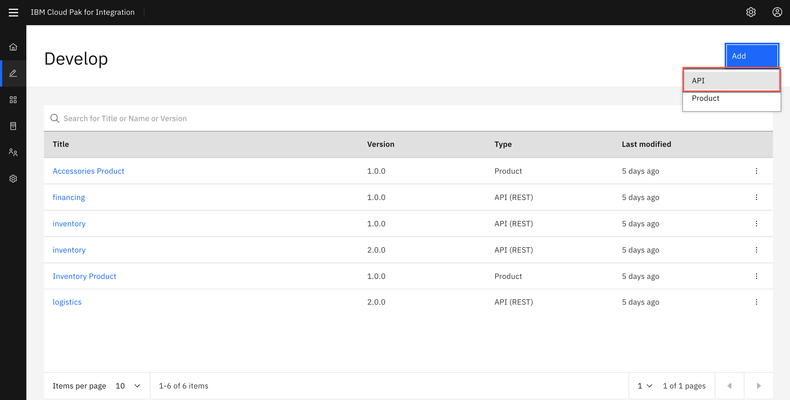

2.  Enter the following values and click Next. You To create a GraphQL
    proxy definition, select From Existing GraphQL service. When you
    point to an existing GraphQL server, API Connect introspects the
    service and automatically creates a GraphQL proxy service.

    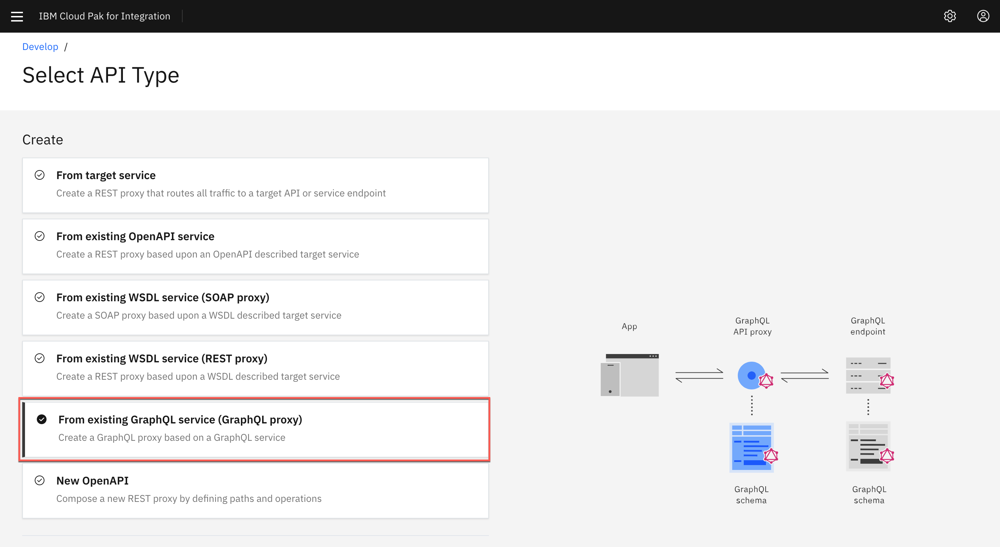

3.  Enter the following values and click Next. You can use default
    values for the rest.

    Title: accounts

    GraphQL server URL: https://graphql-test-server.us-east.cf.appdomain.cloud/accounts/graphql

    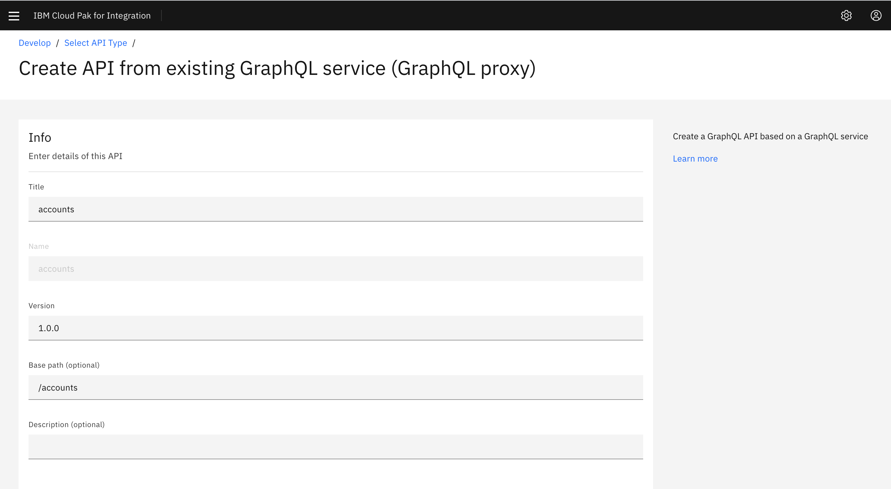

    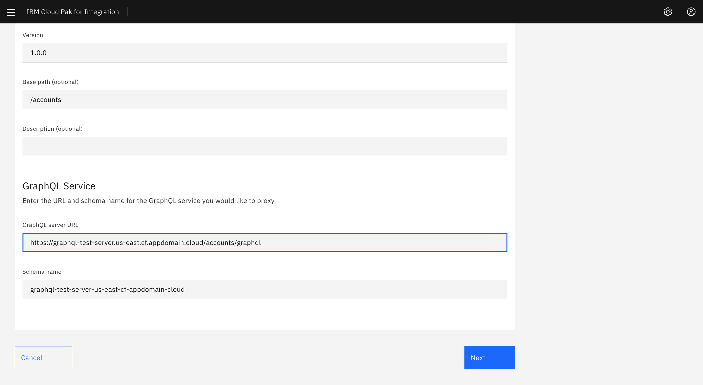

4.  The schema validator reports warning and errors if found. There is
    one warning in the accounts schema imported from the server. You can
    review the schema warning details and also select the end points
    interested for this proxy. Select all the available end points.

    

5.  A review of the schema shows that no limit is set on the size of the
    list. You will fix this warning in later steps. Click Next to
    continue.

    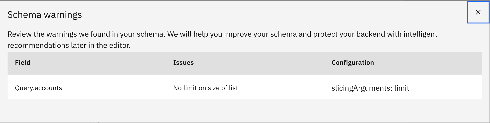

6.  Keep both Secure Client ID and CORS checked and click Next

    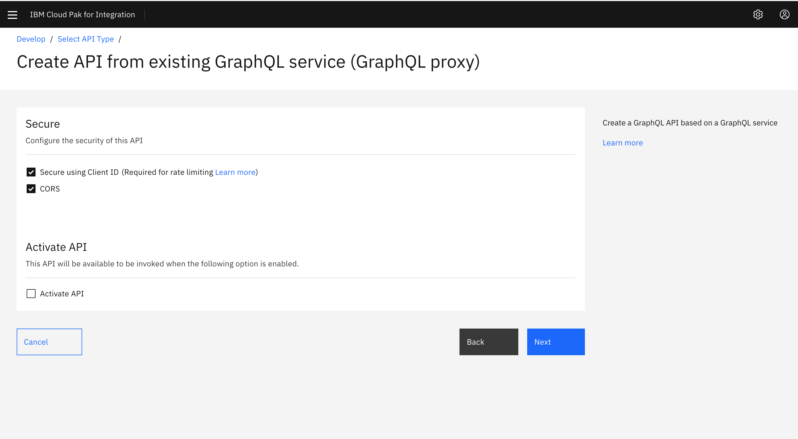

7.  API Connect successfully created a GraphQL proxy API. You can edit
    the API to view more details on the proxy API just created. Click
    EDIT API to continue.

    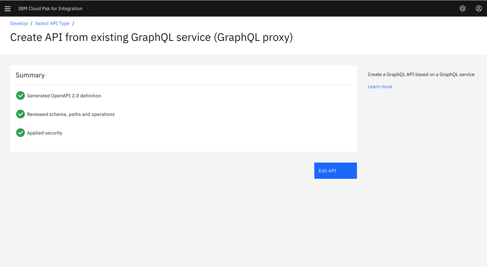

8.  GraphQL APIs are structured the same as REST APIs with some
    additional options. Just like REST APIs, you will be able to add
    security definitions, properties and Activity logs from the left
    menu bar. You can also view the Source and Assemble tabs similar to
    REST APIs. You will notice a new tab for GraphQL APIs. Click on
    GraphQL Schema tab to view the schema.

    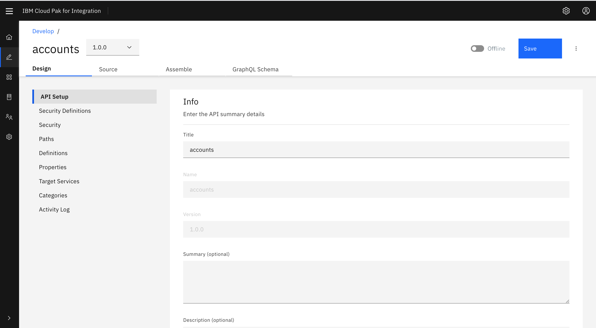

9.  GraphQL Schema editor displays Type and Weight information. The
    weighting factor is used when calculating the type cost for a
    request to the GraphQL API. For example, a field that requires
    extensive CPU or memory use on the server to retrieve its value
    would be given a higher cost.

    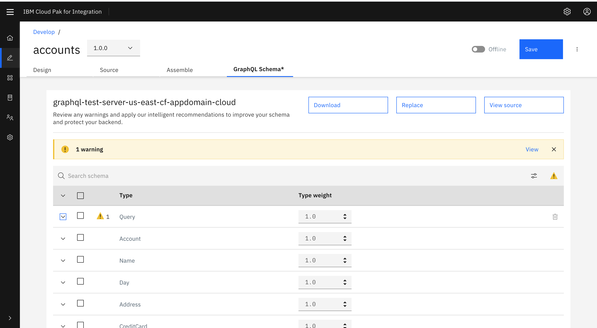

10. Select Query to review the warning details for this type. In
    addition to the warning details, the Warning window gives an option
    to fix the warning by apply the limits. Click Apply to continue.

    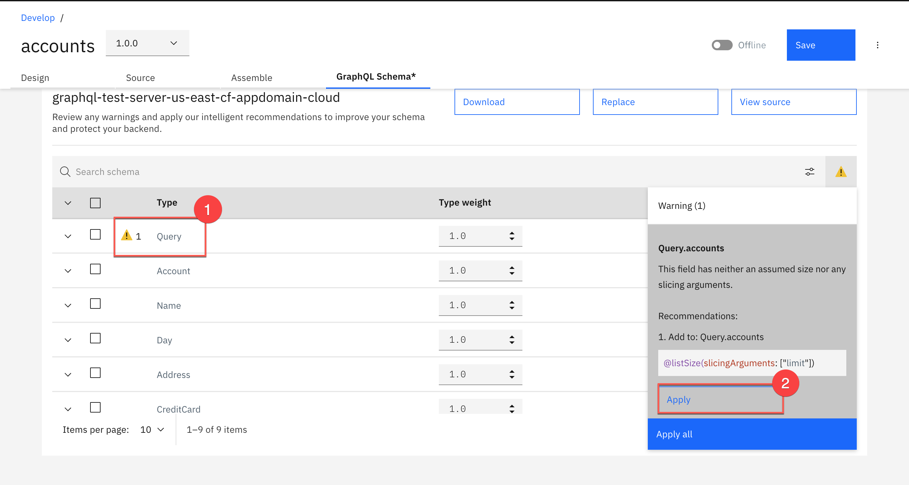

11. After applyting the recommendation the wanrning message is removed.
    Click Save to save the API definition .

    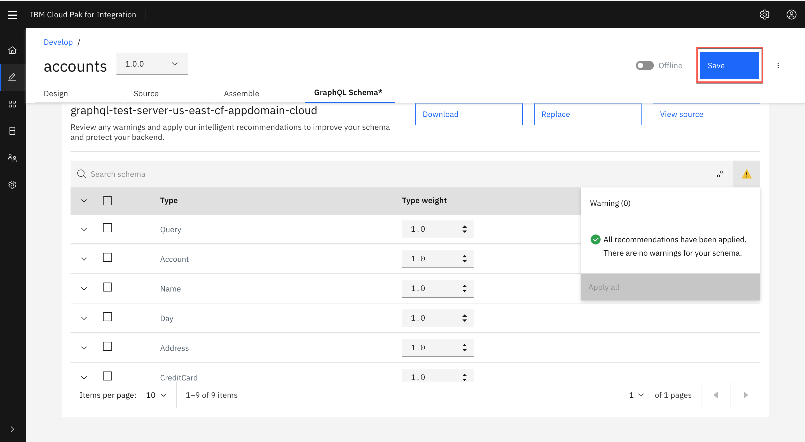

12. Select Assemble to view the API in Assembly view. The flow is
    automatically created as part of the initial API creation. You may
    apply addition logic by dragging and dropping items from the pallet
    to the canvas. In this tutorial, you are not adding additional
    logic.

    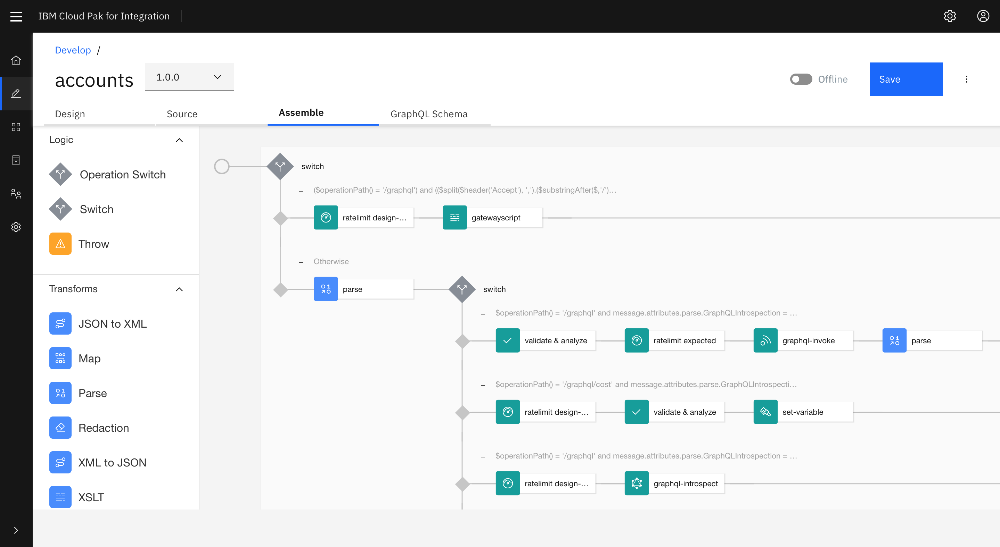

13. To publish the API toggle the button from offline to online.

    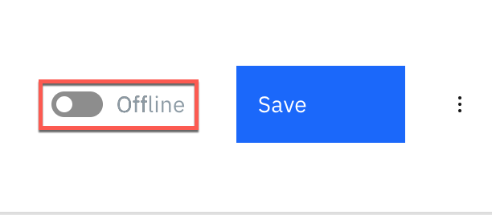

14. After successfully publishing the API to API Gateway, additional
    tabs appear on the screen. Select Test tab to test the API.

    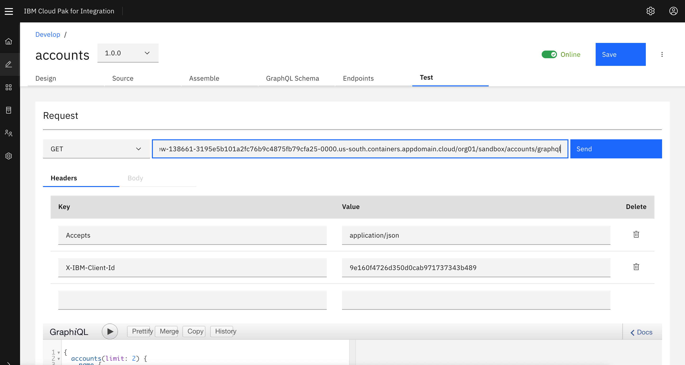

15. To test the API select the end point by append graphql at the end of
    the request URL for GET method. The URL should look like this (your
    value may be different):

    <https://apic-dev-gw-gateway-apic.cp4inew-138661-3195e5b101a2fc76b9c4875fb79cfa25-0000.us-south.containers.appdomain.cloud/org01/sandbox/accounts/graphql>

    Click **Send** to test the API.

    An empty string is returned since we have not specified query string yet.

16. API Connect Test feature also includes GraphQL Editor. Enter the
    following in in GraphQL Editor window. You may use Prettify option
    to view formatting string.

```
{
  accounts(limit: 2) {
    name {
      first
      last
    }
  }
}
```

17. Click Run button to send the GraphQL request to the end point. An
    exception window will appear when you use test the API for the first
    time.


18. Click accept Exception to continue.

    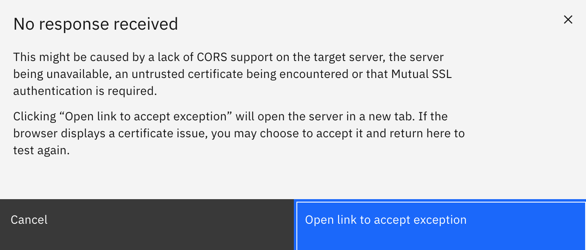

    You may see an invalid certificate issue page when you continue. This is
    because valid certificates are not applied in this test environment. If
    you are using Chrome browser you can accept the exception by typing
    "thisisunsafe" anywhere in the window. Similar workarounds are available
    for other browsers. For firefox browser, follow the steps from here -
    <https://support.mozilla.org/en-US/kb/error-codes-secure-websites>

    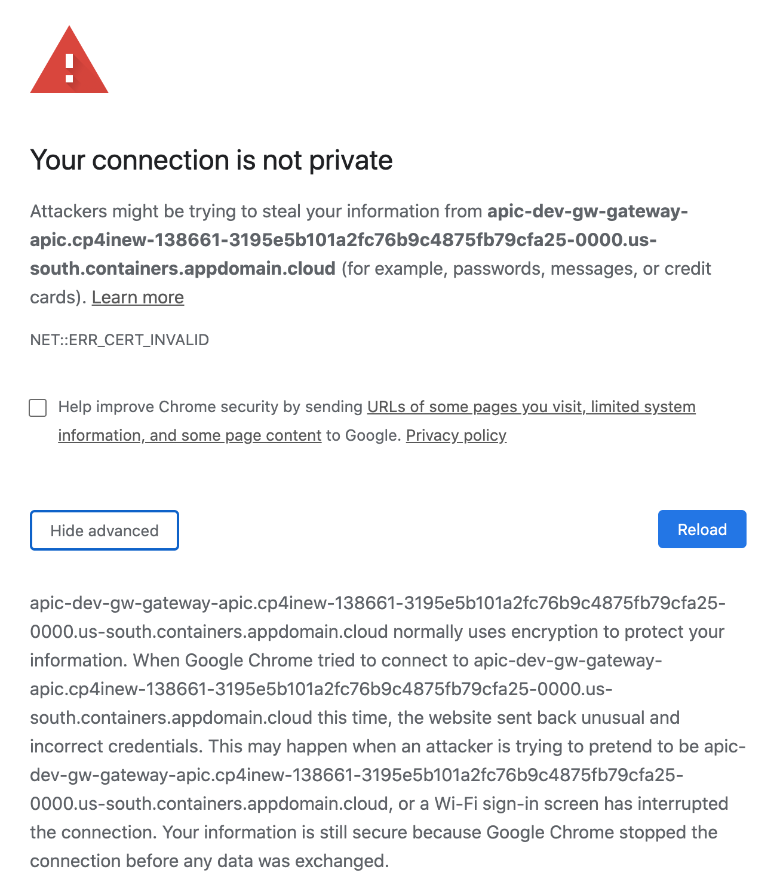

19. The results for GraphQL request are displayed on the right panel. In
    the request we limited the values to 2, so only two accounts are
    displayed. Change the value to 5 and submit the request again and
    notice that more accounts are returned in the results window.

    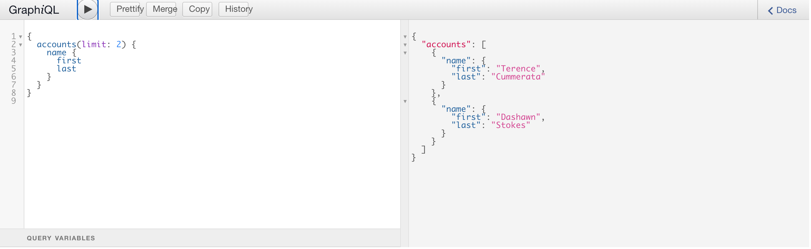

20. You can request additional data fields (refer to the schema editor
    for details), GraphQL may reject if certain fields are locked or
    prohibited. To test this, enter CreditCard information in the
    request field.

    The complete request looks as follows:
```
{
  accounts(limit: 2) {
    name {
      first
      last
    }
    shippingAddress {
      building
      street
    }
  }
  creditCard {
    number
    expirationDate
  }
}
```

  You will notice that an error message is displayed in the results window
  instead of the account values as the server restricts the query field
  creditCard.

  (Note: The error message displayed may be different than what is shown
    in the screenshot).

  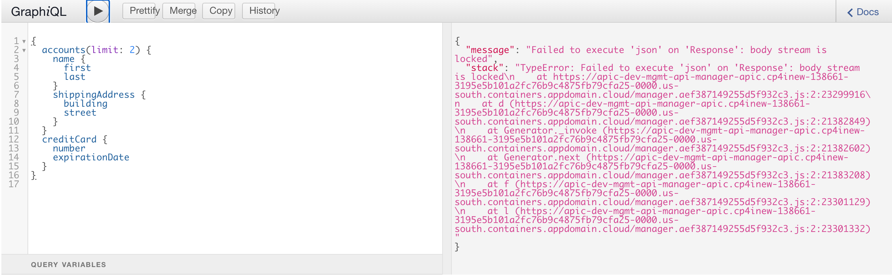

21. Submit another request to get account and shipping address details.
    This time the values are turned without errors.

    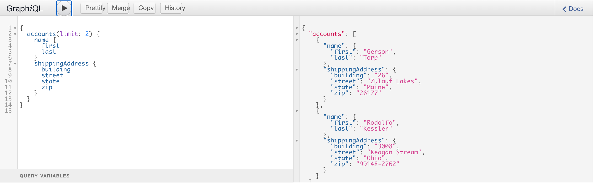

 Create a Product and apply GraphQL RateLimits
====================================================================================================

1.  To create a product Select Develop icon from left menu bar and click
    Add-\>Product

    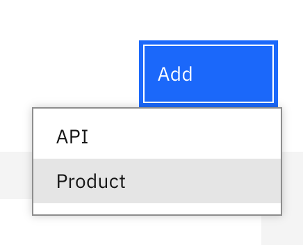

2.  Name the product as Accounts Product and click Next

  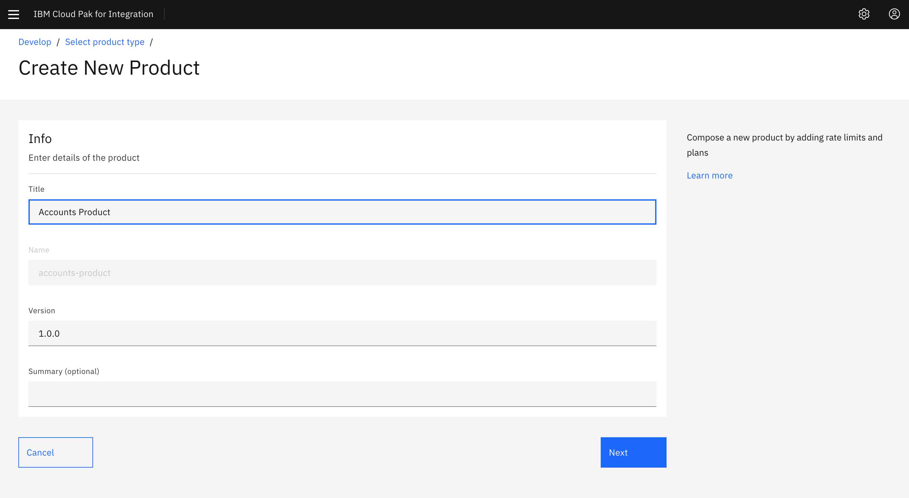

3.  Add Accounts API to the product by selecting accounts. Click Next to
    continue to create the accounts-product.

    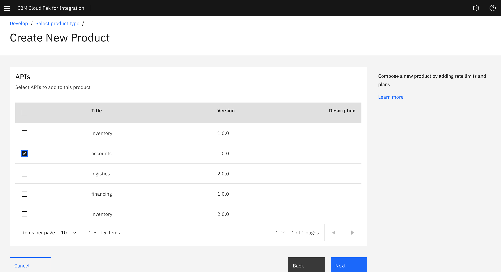

4.  Edit the product accounts-product to review the details. The Default
    Plan contains traditional rate limiting options but you will notice
    another section that list GraphQL Rate Limits.

    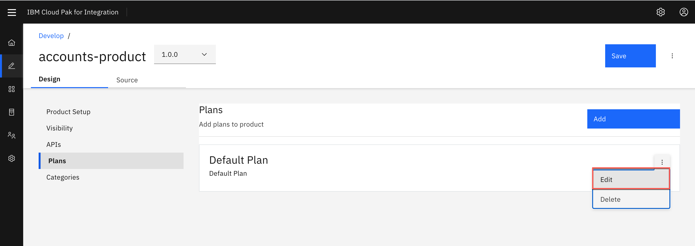

5.  You will be able to adjust GraphQL cost parameters from this
    section. You can set a limit or make it unlimited. You will not be
    making any changes in this tutorial.

    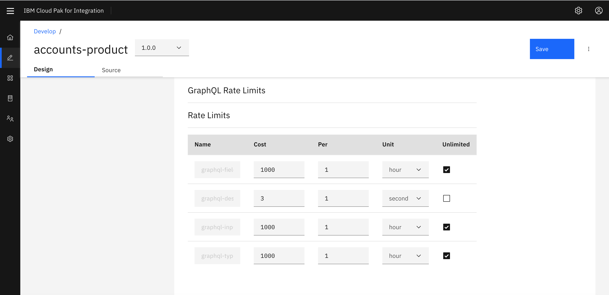

6.  Publish the Product to Sandbox Catalog by selecting Publish

  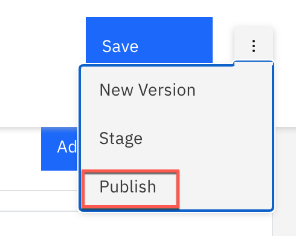

7.  Accept the default for Visibility and Subscribability

  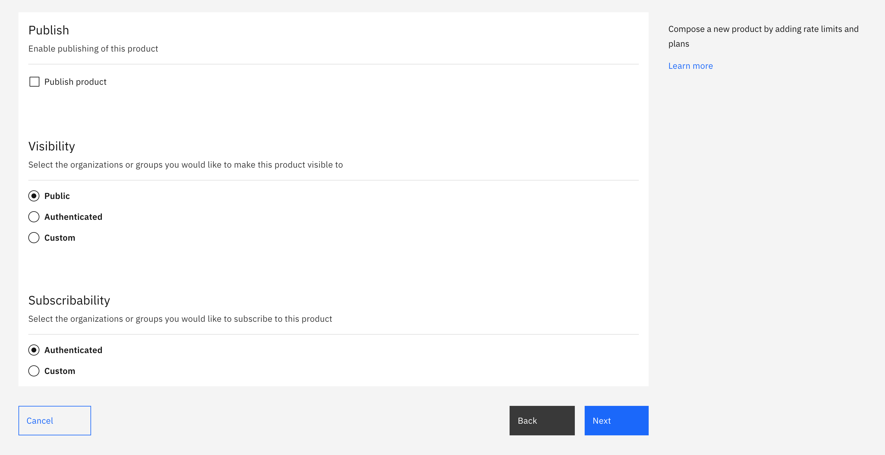

8.  Click Publish to complete publishing the product.

  

 Test GraphQL API from Developer Portal
=============================================================================================

1.  Sign in to API Connect Developer Portal using the Developer Portal
    URL, username and password provided by the instructor.

    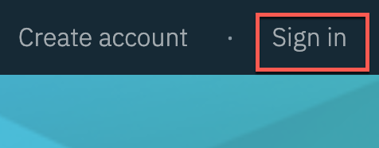

    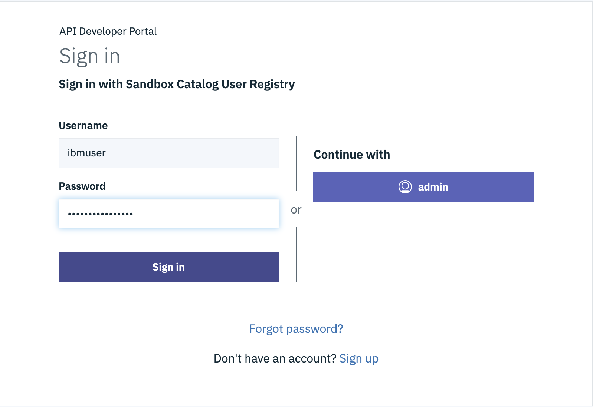

2.  Developer Portal displays all the products that are currently
    published. Locate accounts-product and select the product.

    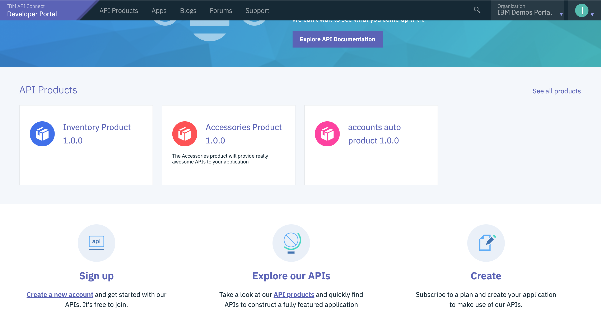

3.  The selected product lists one API (accounts api) and one Plan
    (Default Plan). Select Subscribe option to subscribe to the plan.

    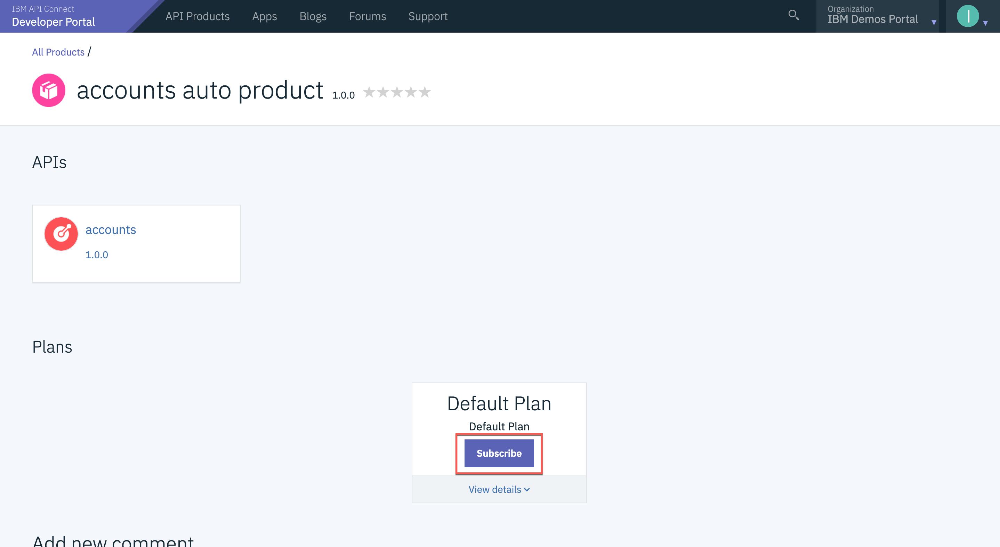

4.  The Plan subscription requires an Application. You can create a new
    Application or select the IBM Consumer application that is already
    created.

    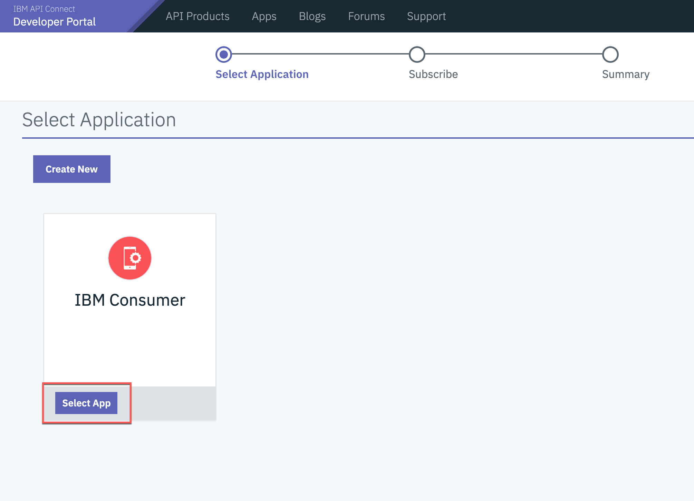

5.  Select accounts API to review and test the API. Click accounts to
    continue

    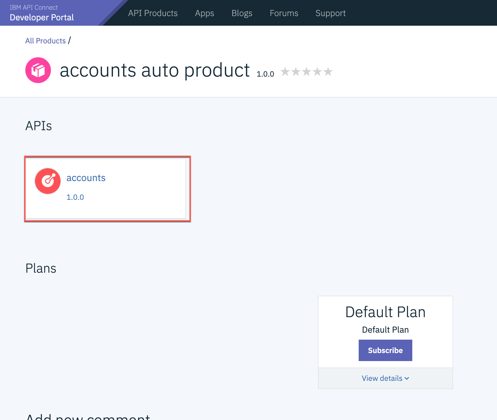

6.  Developer Portal displays the type as GrahQL API. Currently Client
    ID security is enforced. Since there is only on Plan and one
    Consumer Application, the Consumer ID filed is already populated.

    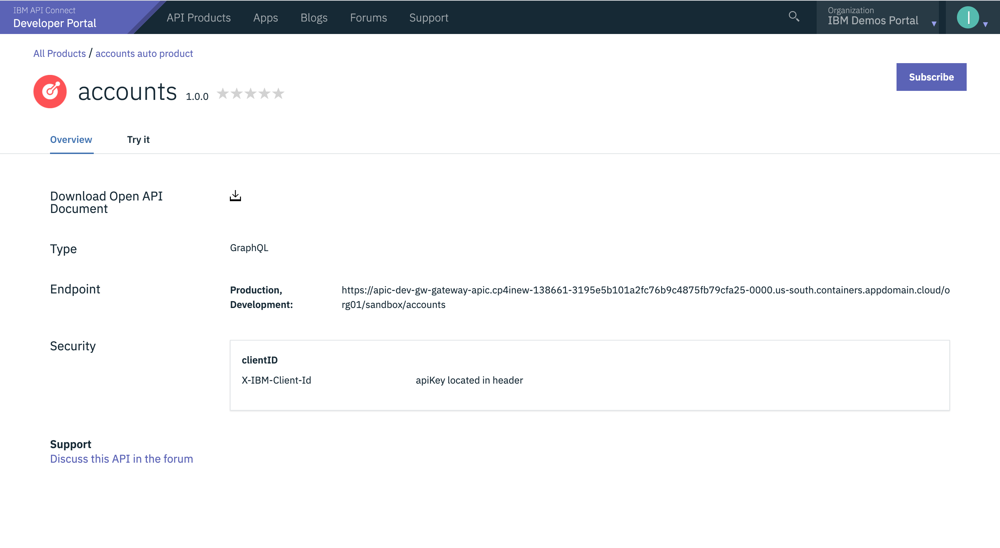

7.  To continue to test the API, use the GraphQL Editor. Submit requests
    with different field names and watch how quickly the results are
    returned in the results window. If this was a REST API multiple end
    points will be needed to achieve the same result.

    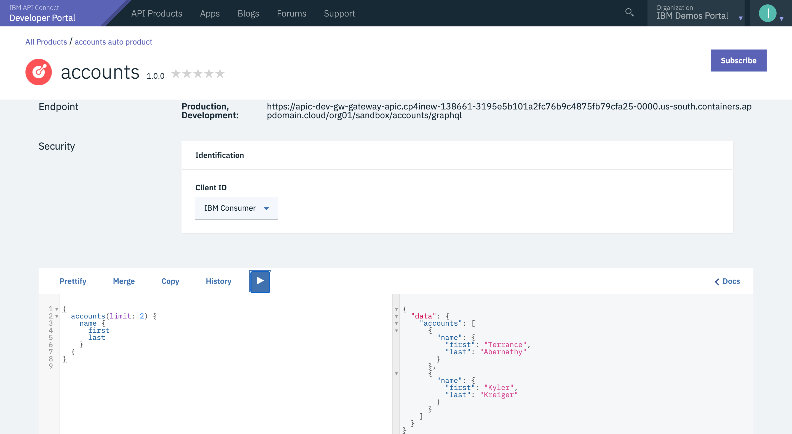

Summary
=================================================================================================================

Congratulations! You have successfully created a GraphQL Proxy API,
published the API as part of a Product, applied controls and rate
limits, and tested using Developer Portal.

To learn more about Cloud Pak for Integration and API Life Cycle
Management, visit <https://www.ibm.com/cloud/cloud-pak-for-integration>
