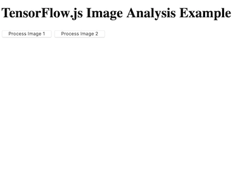
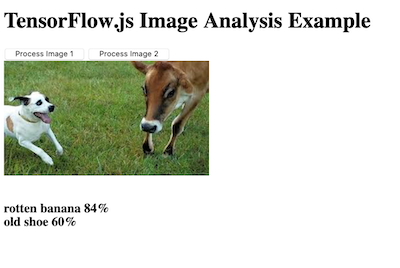
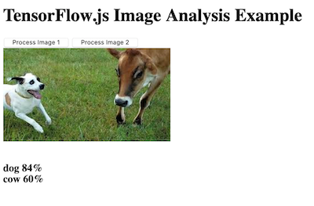

# Register Edge Device with Properties

In this section we will register the agent device back with the IEAM Hub.  We will include a updated set of properties such that the service we created will be deployed to the device as a result of the deployment policy we created.  We will verify the agreement was constructed and accepted, and that the service is running as a local docker container on the edge device.  Finally we will test out the deployed service by invoking its web page.

The `horizon/node_properties.json` contains the properties and constraints that will be associated with this edge device node.  The value for `%HOSTNAME%` will have been substituted with your actual edge device hostname when you processed all the envionment variables earlier.  


```
{
  "properties": [
    {
      "name": "sensor",
      "value": "camera"
    },
    {
      "name": "location",
      "value": "backyard"
    },
    {
      "name": "device",
      "value": "%HOSTNAME%"
    }
  ],
  "constraints": []
}
```

These properties will be used by the IEAM Hub to see if there are any matches with deployment patterns or policies.

1. Register this edge device with the IEAM Hub.
   ``` 
   hzn register --policy horizon/node_properties.json 

   ```

2. An agreement wil be made soon. You can monitor this with the following command.
   ```  
   watch "hzn agreement list"

   ```

3. After a  minute or two an agreement JSON object will display.  Press Ctl-C to cancel the watch.

4. Verify the service is running locally on the device with the following docker command.
   ```
   docker ps

   ```
   You should see a container running.  This is your service that you built and published earlier.  Take note of the container ID.  We will verify that this is the same container running, after we have updated its model.

5. Test the service/application with a web browser.  Use the IEAM Host URL (the same base URL as the IEAM console URL), with the `http` protocol, and a port number that starts with `40` and ends with the two digits of your edge device name.  For example if your edge device is `dev29` then the port number will be `4029`.  A typical service URL will be `http://green.coc-ibm.com:4029`.  The application should look like the following.  


6. Press the Process Image 1 button to have the app load an image (dog and cow) into the web page, then use the TensorFlow model to process it and discover any recognizable objects.  For the first image, the results are not that good.  


   The second image is better. But it is clear that we need an updated model for this service.

   The file `horizon/mms_object.json` contains the definition of a model object that is managed by the IEAM Model Management Service (MMS).
   ```
   {
   "objectID": "$HOSTNAME-model.js",
   "objectType": "model",
   "destinationOrgID": "$HZN_ORG_ID",
   "destinationPolicy": {
     "properties": [],
     "constraints": [
      ],
     "services": [
         {
             "orgID" : "$HZN_ORG_ID",
             "arch": "$ARCH",
             "serviceName" : "$SERVICE_NAME",
             "version": "$SERVICE_VERSION"
        }
     ]
    }, 
    "expiration": "",
    "version": "1.0.0",
    "description": "image demo with tensorflow models",
    "activationTime": ""
   }
   ```  

7. List all the MMS objects on the IEAM Hub. Verify that there are no objects with your device name as a prefix. You may see a number of objects, possibly with prefixes of other device names.  
   ```
   hzn mms object list

   ```  

8. Publish a newer version of the model file used in the service.  
   ```bash
   hzn mms object publish -m horizon/mms_object.json -f models/model2.js

   ```

9. Monitor its status with the following watch.
   ```
   watch "hzn mms object list -t model -i $HOSTNAME-model.js -d"
 
   ```
   You should see the edge device appear as a destination, and the status of the update will change eventually to delivered.

10.  Once the model has been delivered you can go back to your browser with the app running in it and try it again.  This time the first image should process with better results.  


11. Finally we will verify that the docker container did not restart, and that the model update was made in place (in the container).
   ```
   docker ps

   ```

12.  Verify that the container id matches the one you noted back in step 4.


<table align="center">
<tr>
  <td align="left" width="9999"><a href="publish_deployment_policy.md">Previous: Publish Deployment Policy</a> </td>
  <td align="right" width="9999"><a href="README.md">Back to beginning</a> </td>
</tr>
</table>
